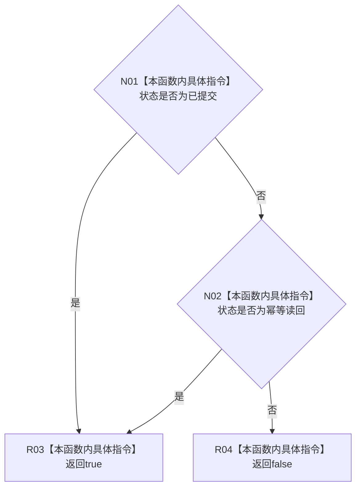

# CF-L7-0063 特征体系业务结果成功现状流程图

图类型：现状流程图
代码版本：`3920a74638264f9f539d50f32f3c9fe5fb1982ab`
源码 blob：`a47cd9b07794d30abc6cb9d1df319056105cd596`
覆盖文件：`海中鱼巣/领域/数据操作.特征体系.ixx:189-192`
唯一根函数：R0369
完整签名：`bool 海中鱼巣::特征体系业务结果::成功() const noexcept`
参数：无；只读当前结果对象
返回结果：状态为已提交或幂等读回时返回 true，否则返回 false
已登记调用方：F0455、R0229（RCE0789、RCE2170）
直接项目函数：无；外部边界：无；未解析项目调用：0
逐行映射表：`流程图/代码流程图/L7/CF-L7-0063_特征体系业务结果成功_逐行代码映射表.md`
依据：关系发布基线 `8d93afa94c066dd8728938e2a40f3a9f3c0c0d52` 与冻结源码
结构读取与写入：只读状态，不改变机器结构
不得作为施工许可：是
不得宣称：返回 true 会再次提交或写入结构

## 流程图

## 当前边界

- 本函数只解释结果状态，不产生结构副作用。
