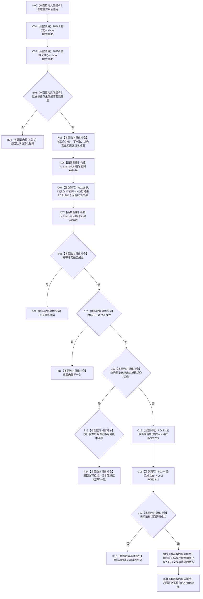

# CF-L7-0065 系统角色发布世界拓扑现状流程图

图类型：现状流程图
代码版本：`3920a74638264f9f539d50f32f3c9fe5fb1982ab`
源码 blob：`b24322d4588808299a232bc308bebd463b7a87a0`
覆盖文件：`海中鱼巣/领域/数据操作.系统角色.ixx:124-179`
唯一根函数：R0409
完整签名：`海中鱼巣::系统角色初始化结果 海中鱼巣::系统角色数据操作::发布世界拓扑(const 海中鱼巣::系统角色主体材料& 主体) const`
参数：`主体` 为调用方拥有的只读借用
返回结果：入口无效返回默认结果；幂等冲突、内部不一致、许可拒绝或版本漂移返回相应状态；拓扑读回成功时返回已提交或幂等读回状态及当前清单
已登记调用方：F0455（RCE0227）
直接项目函数：F0449（RCE2840）、F0458（RCE2841）、R0116（RCE1284）、R0421（RCE1285）、F0074（RCE2842）
回调函数：R0410，由 R0116 经 RCE0561 调用
外部边界：X03826（`std::function<void(结构写入会话&)>` 构造）、X03827（同类型析构）
逐行映射表：`流程图/代码流程图/L7/CF-L7-0065_系统角色发布世界拓扑_逐行代码映射表.md`
结构读取与写入：委托 R0116/R0410 在结构写入会话中复核并补齐世界根—场景—自我普通父子拓扑；随后经 R0421 只读回查完整当前清单
逻辑内返回：入口材料无效、执行器许可拒绝或版本漂移，以及既有拓扑精确幂等时的具名结果
内部错误边界：主体和精确关系已通过前置后，关系复核、挂载、提交请求、提交状态或发布后读回不一致
依据提交 / 结构化消息：聚合关系基线 `7951b1bea78c7338643ab18428180d521e4d5a62`；冻结源码提交 `3920a74638264f9f539d50f32f3c9fe5fb1982ab`
验证输出：本批 Mermaid、节点双向、源码覆盖与差异格式检查
不得作为施工许可：是
不得宣称：返回成功表示系统角色初始化全链或项目阶段完成

## 流程图

## 当前边界

- R0410 是本函数在第 132—157 行定义的非平凡回调，其内部结构写入路径由独立单函数图展开；R0409 只经 R0116 注册并同步执行该回调。
- 只有 `改变了结构` 为 true 时，回调才请求提交；幂等无变化路径不请求提交，发布后仍经 R0421 读回当前清单。
- RCE2840—RCE2842 补齐入口有效性、主体完整性和发布后结果成功判断；X03826/X03827 分账 `std::function` 临时对象构造与析构。
