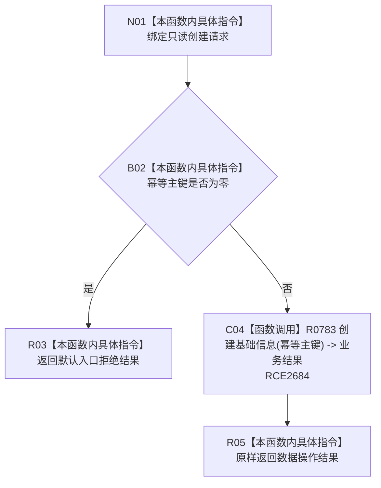

# CF-L7-0067 基础信息业务服务创建基础信息身份现状流程图

图类型：现状流程图
代码版本：`0a93526882cb33c61c2fbb04ecad1aeaddcfe225`
当前工作区复核基线：`ece29318f80cad2ce7a4abce9b009c60cd4cdfdd`
源码 blob：`06952da7ebc216864c12e30add88e7faa280e4a5`
覆盖文件：`海中鱼巣/领域/服务.基础信息.ixx:22-25`
唯一根函数：R0496
完整签名：`语义基础业务结果 海中鱼巣::基础信息业务服务::创建基础信息身份(const 创建基础信息身份请求& 请求) const`
参数：`请求` 为调用期只读借用；读取 `幂等主键`
返回结果：零主键返回默认入口拒绝；非零主键原样返回 R0783 的语义基础业务结果
已登记调用方：F0455（RCE0230）
直接项目函数：R0783（RCE2684）
外部边界：无新增建议
逐行映射表：`流程图/代码流程图/L7/CF-L7-0067_基础信息业务服务创建基础信息身份_逐行代码映射表.md`
不得作为施工许可：是
不得宣称：非零主键必然创建新结构，或基础信息业务已经整体完成

## 流程图

## 关键边界

- 本函数只执行零主键门禁；幂等、冲突、提交和读回过程由 R0783 承载。
- 返回数据操作结果不等于本函数自行写入结构。
