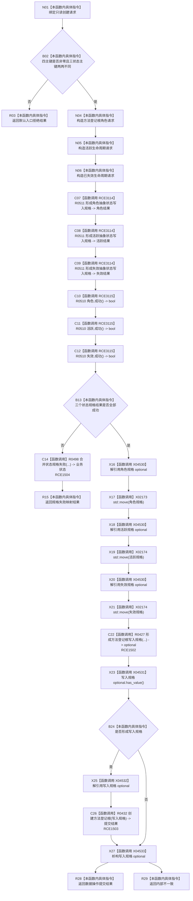

# CF-L7-0068 方法业务服务创建登记根现状流程图

图类型：现状流程图
代码版本：`0a93526882cb33c61c2fbb04ecad1aeaddcfe225`
当前工作区复核基线：`ece29318f80cad2ce7a4abce9b009c60cd4cdfdd`
源码 blob：`74a839fe2d983516ff7cb623d45464f8c7fdf5fb`
覆盖文件：`海中鱼巣/领域/服务.方法.ixx:79-106`
唯一根函数：R0499
完整签名：`方法提交结果 海中鱼巣::方法业务服务::创建登记根(const 创建方法登记根请求& 请求) const`
参数：`请求` 为调用期只读借用；读取四个幂等主键
返回结果：入口拒绝、状态规格失败映射、数据操作创建结果或内部不一致
已登记调用方：F0455（RCE0224）
直接项目函数：R0427（RCE1502）、R0432（RCE1503）、R0498（RCE1504）、R0511（RCE3114）、R0510（RCE3115）
外部边界：X02173、X02174、X04530—X04533
逐行映射表：`流程图/代码流程图/L7/CF-L7-0068_方法业务服务创建登记根_逐行代码映射表.md`
不得作为施工许可：是
不得宣称：状态规格形成成功等于登记根已经提交，或任一返回证明方法能力整体完成

## 流程图

## 关键边界

- 本函数在形成三个抽象状态规格前拒绝零主键与状态主键冲突。
- 三个规格结果均成功后才移动规格并调用 R0427；真正登记根事务与读回由 R0432 承载。
- R0511 的三次规格形成调用聚合为 RCE3114，R0510 的三次成功检查聚合为 RCE3115。
