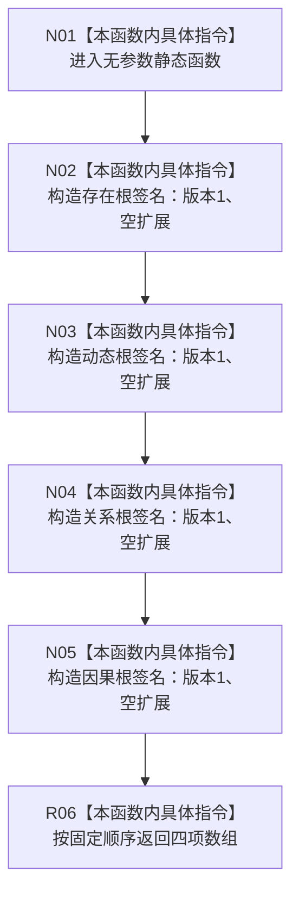

# CF-L7-0069 概念活动业务服务形成规范根签名组现状流程图

图类型：现状流程图
代码版本：`0a93526882cb33c61c2fbb04ecad1aeaddcfe225`
当前工作区复核基线：`ece29318f80cad2ce7a4abce9b009c60cd4cdfdd`
源码 blob：`c96b7a88a6486ebbe8c23948fb9cca6e8effd23e`
覆盖文件：`海中鱼巣/领域/服务.概念活动.ixx:90-96`
唯一根函数：R0500
完整签名：`static std::array<概念签名材料, 4> 海中鱼巣::概念活动业务服务::形成规范根签名组()`
参数：无
返回结果：依次包含存在、动态、关系、因果四类根，版本均为 1、扩展材料均为空的定长数组
已登记调用方：F0461（RCE0236）、F0462（RCE0238）
直接项目函数：无
外部边界：无新增建议
逐行映射表：`流程图/代码流程图/L7/CF-L7-0069_概念活动业务服务形成规范根签名组_逐行代码映射表.md`
不得作为施工许可：是
不得宣称：四项签名已在任何仓库中写入、发布或通过运行验证

## 流程图

## 关键边界

- 本函数只构造值式签名数组，不访问成员状态或外部仓库。
- 数组顺序是当前源码事实；本图不把该顺序升级为新的机器规范。
