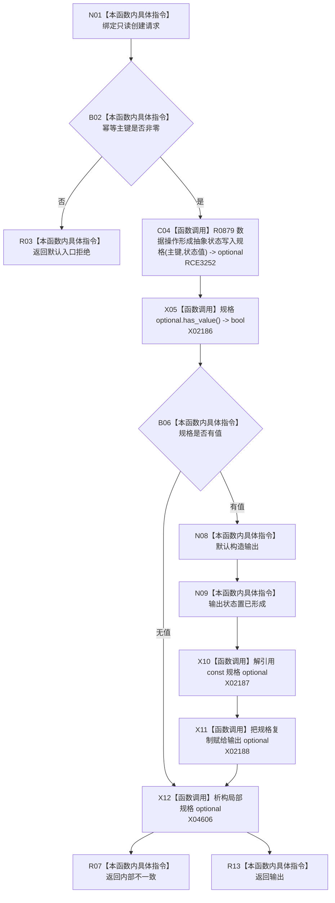

# CF-L7-0071 状态业务服务形成抽象状态写入规格现状流程图

图类型：现状流程图
代码版本：`0a93526882cb33c61c2fbb04ecad1aeaddcfe225`
当前工作区复核基线：`c3939fcd2fe13b6a5ba69e5dcad6efc519bdf667`
源码 blob：`0576315b712424990f8e1c0abd57be681539daf7`
覆盖文件：`海中鱼巣/领域/服务.状态.ixx:81-89`
唯一根函数：R0511
完整签名：`抽象状态规格结果 海中鱼巣::状态业务服务::形成抽象状态写入规格(const 创建抽象状态请求& 请求) const`
参数：`请求` 为调用期只读借用
返回结果：零主键返回入口拒绝；数据操作未形成规格返回内部不一致；否则返回已形成且含规格的结果
已登记调用方：R0514、F0462、R0499
直接项目函数：R0879（RCE3252；`状态动态数据操作::形成抽象状态写入规格`）
外部边界：X02186—X02188；局部规格 optional 析构为 X04606
逐行映射表：`流程图/代码流程图/L7/CF-L7-0071_状态业务服务形成抽象状态写入规格_逐行代码映射表.md`
不得作为施工许可：是
不得宣称：规格已形成等于抽象状态已经提交

## 流程图

## 关键边界

- R0879 的源码位于 `海中鱼巣/领域/数据操作.状态动态.ixx:328-335`；其直接闭包经 RCE3253 调用 R0880（私有规格构造函数），经 RCE3254 调用 R0795，均已纳入当前可达关系表。
