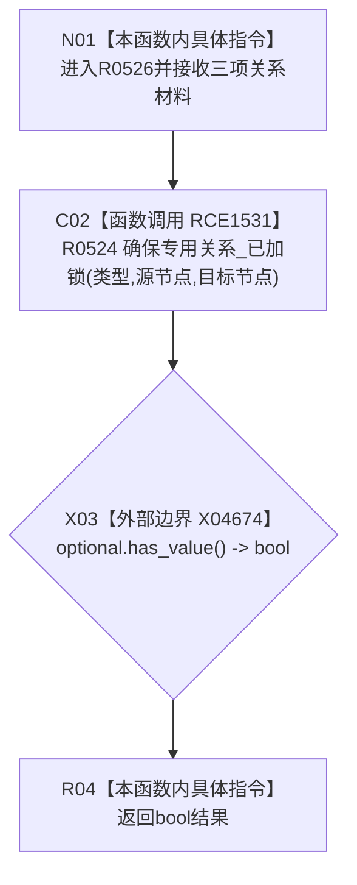

# CF-L7-0072 概念图服务幂等创建专用关系现状流程图

图类型：现状流程图
代码版本：`0a93526882cb33c61c2fbb04ecad1aeaddcfe225`
工作区复核基线：`c3939fcd2fe13b6a5ba69e5dcad6efc519bdf667`
源码 blob：`dc4bd08f99622b3380c91dd15258fc8ab2e1b9c6`
覆盖文件：`海中鱼巣/领域/概念图服务.h:4401-4403`
唯一根函数：R0526
完整签名：`bool 海中鱼巣::概念图服务::幂等创建专用关系(海中鱼巣::关系类型 类型, 海中鱼巣::节点句柄 源节点, 海中鱼巣::节点句柄 目标节点)`
参数：关系类型、源节点、目标节点均按值
返回结果：R0524 返回有值时为 `true`，空值时为 `false`
已登记调用方：F0370（RCE0155）
直接项目函数：R0524（RCE1531）
外部边界：X04674（`optional<关系句柄>::has_value()`）
逐行映射表：`流程图/代码流程图/L7/CF-L7-0072_概念图服务幂等创建专用关系_逐行代码映射表.md`
结构读写：所有关系读取、创建和运行期登记副作用均由 R0524 决定
不得作为施工许可：是
不得宣称：返回 false 代表关系仓和运行期登记均未发生任何变化

## 流程图

## 当前边界

- 本函数不自行加锁；当前调用路径必须满足 R0524 的已加锁前置。
- R0524 的新建后读回失败可能留下关系记录，因此本函数的 `false` 不能解释为零变化。
