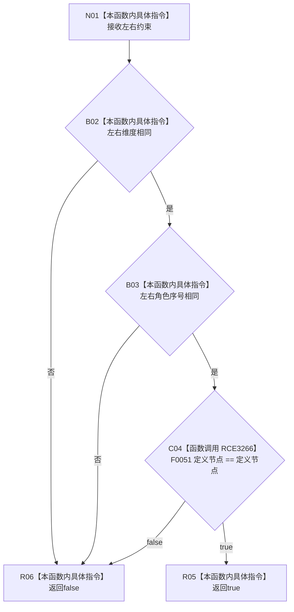

# CF-L7-0073 概念图算法约束身份相同现状流程图

图类型：现状流程图
代码版本：`0a93526882cb33c61c2fbb04ecad1aeaddcfe225`
工作区复核基线：`2089268fbb3833ebc77486169b98d8a14c49d508`
源码 blob：`31c9794099a8fc191c3d5d9369010c52cd863039`
覆盖文件：`海中鱼巣/领域/概念图算法.h:625-629`
唯一根函数：R0534
完整签名：`static bool 海中鱼巣::概念图算法::约束身份相同(const 概念约束材料& 左, const 概念约束材料& 右)`
参数：左、右均为 `const 概念约束材料&`，只读借用
返回结果：维度、角色序号和定义节点均相同时返回 `true`，否则按 `&&` 短路返回 `false`
已登记调用方：R0532（RCE1538）、R0535（RCE1542）
直接项目函数：F0051（RCE3266，定义节点相等比较）
外部边界：无
逐行映射表：`流程图/代码流程图/L7/CF-L7-0073_概念图算法约束身份相同_逐行代码映射表.md`
结构读写：只读两份约束身份字段
不得作为施工许可：是
不得宣称：身份相同代表两份约束的值内容相同

## 流程图

## 当前边界

- 比较按 `&&` 从左向右短路；维度或角色序号不同时不会比较定义节点。
- F0051 是项目源码运算符，不能作为内建比较省略；其调用边已登记为 RCE3266。
