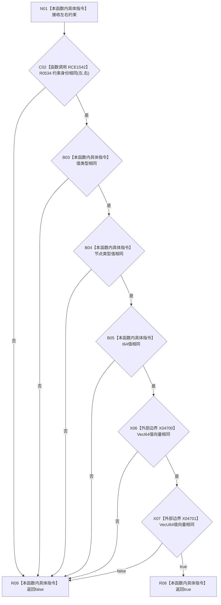

# CF-L7-0074 概念图算法约束相同现状流程图

图类型：现状流程图
代码版本：`0a93526882cb33c61c2fbb04ecad1aeaddcfe225`
工作区复核基线：`2089268fbb3833ebc77486169b98d8a14c49d508`
源码 blob：`31c9794099a8fc191c3d5d9369010c52cd863039`
覆盖文件：`海中鱼巣/领域/概念图算法.h:631-638`
唯一根函数：R0535
完整签名：`static bool 海中鱼巣::概念图算法::约束相同(const 概念约束材料& 左, const 概念约束材料& 右)`
参数：左、右均为 `const 概念约束材料&`，只读借用
返回结果：约束身份、值类型、节点类型值、I64 值及两个向量值均相同时返回 `true`，否则按 `&&` 短路返回 `false`
已登记调用方：R0532（RCE1539）、R0536（RCE1543）
直接项目函数：R0534（RCE1542）
外部边界：X04700（VecI64 vector 相等）、X04701（VecU64 vector 相等）
逐行映射表：`流程图/代码流程图/L7/CF-L7-0074_概念图算法约束相同_逐行代码映射表.md`
结构读写：只读两份约束全部比较字段
不得作为施工许可：是
不得宣称：约束相同代表所属概念签名、概念节点或业务语义相同

## 流程图

## 当前边界

- 所有比较按 `&&` 从左向右短路。
- vector 相等比较属于标准库边界，分别登记为 X04700 与 X04701。
