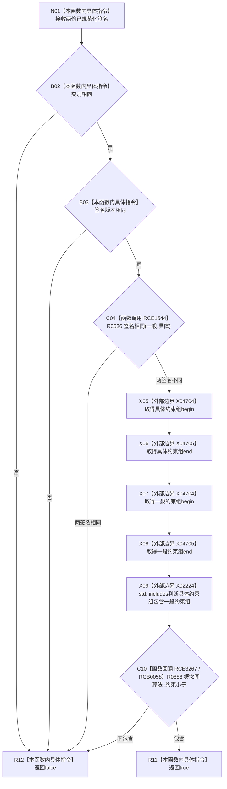

# CF-L7-0075 概念图算法签名更一般已规范化现状流程图

图类型：现状流程图
代码版本：`0a93526882cb33c61c2fbb04ecad1aeaddcfe225`
工作区复核基线：`2089268fbb3833ebc77486169b98d8a14c49d508`
源码 blob：`31c9794099a8fc191c3d5d9369010c52cd863039`
覆盖文件：`海中鱼巣/领域/概念图算法.h:684-694`
唯一根函数：R0537
完整签名：`static bool 海中鱼巣::概念图算法::签名更一般_已规范化(const 概念签名材料& 一般, const 概念签名材料& 具体)`
参数：一般、具体均为 `const 概念签名材料&`，只读借用；调用方保证两份签名已规范化
返回结果：类别和版本相同、两签名不完全相同且具体约束组包含一般约束组时返回 `true`，否则按 `&&` 短路返回 `false`
已登记调用方：R0533（RCE1541）
直接项目函数：R0536（RCE1544）、R0886（RCE3267；经 RCB0058 回调）
外部边界：X02224（`std::includes`）、X04704（vector `begin()`）、X04705（vector `end()`）
逐行映射表：`流程图/代码流程图/L7/CF-L7-0075_概念图算法签名更一般已规范化_逐行代码映射表.md`
结构读写：只读两份已规范化签名
不得作为施工许可：是
不得宣称：严格一般性成立代表概念继承关系、关系边或活动图已经写入

## 流程图

## 当前边界

- `std::includes` 只在类别、版本相同且两签名不完全相同时执行。
- R0886 `约束小于` 是 `std::includes` 的项目比较器回调，与 R0532 的 `std::sort` 共享同一函数身份。
