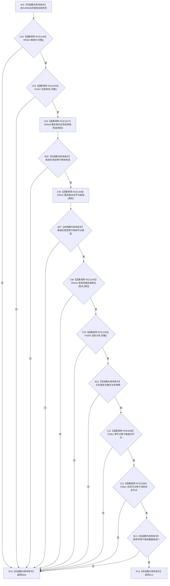

# CF-L7-0076 概念活动根材料完整现状流程图

图类型：现状流程图
代码版本：`0a93526882cb33c61c2fbb04ecad1aeaddcfe225`
工作区复核基线：`2089268fbb3833ebc77486169b98d8a14c49d508`
源码 blob：`a4090a7643aa12c41f2830eb5f51593aabde7488`
覆盖文件：`海中鱼巣/领域/概念活动状态.数据.h:104-113`
唯一根函数：R0538
完整签名：`bool 海中鱼巣::概念活动根材料::完整(const 海中鱼巣::概念活动状态角色材料& 活跃角色) const noexcept`
参数：隐式 `this` 为只读当前根材料；`活跃角色` 为借用的 `const 概念活动状态角色材料&`
返回结果：根身份、活跃角色、用途、节点类型、签名、生命周期关系端点和顺序号全部一致时返回 `true`，任一条件不成立时按 `&&` 短路返回 `false`
已登记调用方：F0466（RCE1683）、R0337（RCE2728）
已登记直接项目函数：R0563（RCE1546）、F0467（RCE1545）、R0540（RCE1547）、R0541（RCE1548）、R0542（RCE1549）、F0459（RCE1550）、F0051（RCE3268）
外部边界：无
逐行映射表：`流程图/代码流程图/L7/CF-L7-0076_概念活动根材料完整_逐行代码映射表.md`
结构读写：只读当前根材料、根身份、活跃角色和活跃关系字段，不改变机器结构
不得作为施工许可：是
不得宣称：单个根材料完整代表全部四类概念根、完整概念活动材料或业务服务已经复核完成

## 流程图

## 当前边界

- 全部条件按源码中的 `&&` 从左到右短路；后续字段或函数只在此前条件为真时求值。
- 第 110—111 行两次节点句柄比较的静态接收者均为 F0051，并聚合登记为项目边 RCE3268。
- `false` 是本函数的完整性检查结果；本函数不写入、修复或发布任何概念活动结构。
