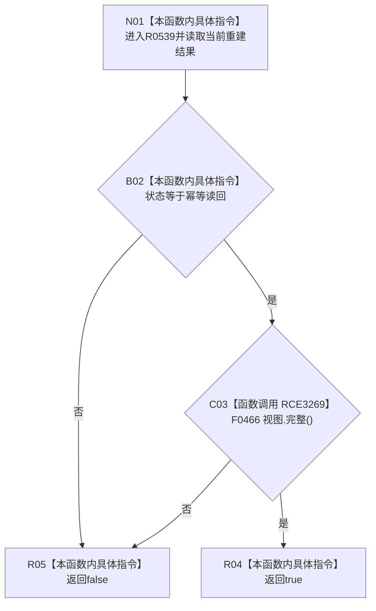

# CF-L7-0077 概念活动重建结果成功现状流程图

图类型：现状流程图
代码版本：`0a93526882cb33c61c2fbb04ecad1aeaddcfe225`
工作区复核基线：`2089268fbb3833ebc77486169b98d8a14c49d508`
源码 blob：`a4090a7643aa12c41f2830eb5f51593aabde7488`
覆盖文件：`海中鱼巣/领域/概念活动状态.数据.h:201-203`
唯一根函数：R0539
完整签名：`bool 海中鱼巣::概念活动重建结果::成功() const noexcept`
参数：无显式参数；隐式 `this` 为只读当前重建结果
返回结果：状态为 `幂等读回` 且重建视图完整时返回 `true`，否则按 `&&` 短路返回 `false`
已登记调用方：F0461（RCE0237）、F0462（RCE2188）
已登记直接项目函数：F0466（RCE3269）
外部边界：无
逐行映射表：`流程图/代码流程图/L7/CF-L7-0077_概念活动重建结果成功_逐行代码映射表.md`
结构读写：只读业务状态和重建视图，不改变机器结构
不得作为施工许可：是
不得宣称：返回 `true` 代表初始化提交、持久化、发布或完整概念活动材料均已成功

## 流程图

## 当前边界

- `视图.完整()` 只在状态为 `幂等读回` 时调用。
- 第 202 行对 F0466 的直接 const 成员调用已登记为项目边 RCE3269。
- 本函数是结果读取判定，不写入状态、视图或仓库。
