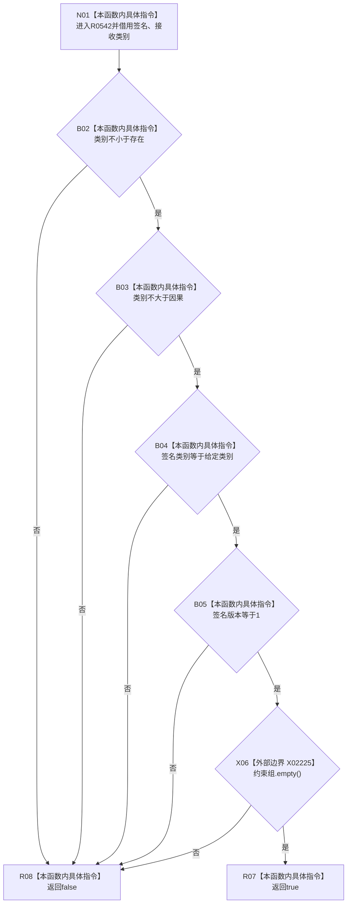

# CF-L7-0078 是规范概念根签名现状流程图

图类型：现状流程图
代码版本：`0a93526882cb33c61c2fbb04ecad1aeaddcfe225`
工作区复核基线：`2089268fbb3833ebc77486169b98d8a14c49d508`
源码 blob：`a4090a7643aa12c41f2830eb5f51593aabde7488`
覆盖文件：`海中鱼巣/领域/概念活动状态.数据.h:93-96`
唯一根函数：R0542
完整签名：`inline bool 海中鱼巣::是规范概念根签名(const 概念签名材料& 签名, 概念根类别 类别) noexcept`
参数：`签名` 为借用的只读概念签名材料；`类别` 按值传入并允许任意底层枚举值
返回结果：类别在存在至因果范围内、签名类别相同、签名版本为 1 且约束组为空时返回 `true`，否则按 `&&` 短路返回 `false`
已登记调用方：F0465（RCE0242）、R0333（RCE1059）、R0538（RCE1549）
直接项目函数：无
外部边界：X02225（`std::vector<概念约束材料>::empty()`）
逐行映射表：`流程图/代码流程图/L7/CF-L7-0078_是规范概念根签名_逐行代码映射表.md`
结构读写：只读签名字段与约束容器，不改变机器结构
不得作为施工许可：是
不得宣称：签名规范代表对应概念根身份、节点、主信息或生命周期关系均完整

## 流程图

## 当前边界

- 全部判断按源码中的 `&&` 从左到右短路；仅在类别、签名类别和版本均通过后调用 X02225。
- 当前实现把版本 `1` 和空约束组作为规范概念根签名的固定条件。
