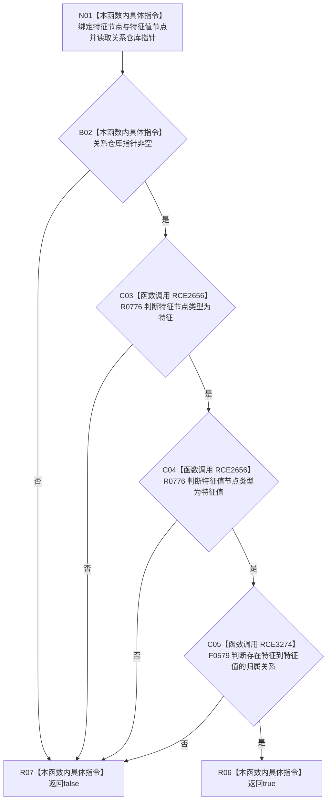

# CF-L7-0079 特征值属于特征现状流程图

图类型：现状流程图
代码版本：`0a93526882cb33c61c2fbb04ecad1aeaddcfe225`
工作区复核基线：`03a8b7ac099ccea83e57f2696e2290b7bcdfacaf`
源码 blob：`4c7bcd451f2e46e85d707a40c371dcbeaa2c1169`
覆盖文件：`海中鱼巣/领域/特征服务.h:1009-1014`
唯一根函数：R0558
完整签名：`bool 海中鱼巣::特征服务::特征值属于特征(节点句柄 特征节点, 节点句柄 特征值节点) const`
参数：`特征节点`、`特征值节点` 均按值输入；`this` 为 const；内部关系仓库指针只读使用
返回结果：关系仓库存在、两个节点类型分别匹配特征与特征值且存在对应归属关系时返回 `true`，否则按 `&&` 短路返回 `false`
已登记调用方：F0555（RCE0257）、R0562（RCE1568）、R0860—R0863（RCE3166、RCE3168、RCE3170、RCE3172）
直接项目函数：R0776（RCE2656，两处调用）、F0579（RCE3274）
外部边界：无
逐行映射表：`流程图/代码流程图/L7/CF-L7-0079_特征值属于特征_逐行代码映射表.md`
结构读写：只读关系仓库指针、节点类型和归属关系，不修改节点或关系
不得作为施工许可：是
不得宣称：返回 `true` 代表特征值内容有效、唯一或已发布

## 流程图

## 当前边界

- 四项判断按 `&&` 从左向右短路，关系仓库为空时不会读取节点或关系。
- `关系_->存在关系(...)` 静态绑定 F0579，源码调用点为 1013，对应 RCE3274。
