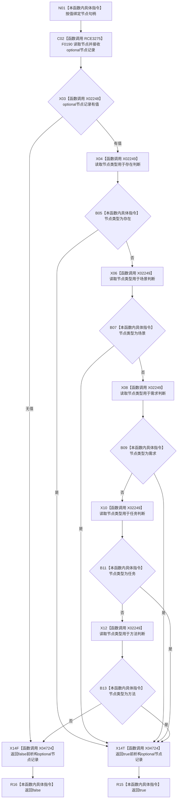

# CF-L7-0080 节点类型是允许特征宿主现状流程图

图类型：现状流程图
代码版本：`0a93526882cb33c61c2fbb04ecad1aeaddcfe225`
工作区复核基线：`03a8b7ac099ccea83e57f2696e2290b7bcdfacaf`
源码 blob：`4c7bcd451f2e46e85d707a40c371dcbeaa2c1169`
覆盖文件：`海中鱼巣/领域/特征服务.h:1209-1219`
唯一根函数：R0559
完整签名：`bool 海中鱼巣::特征服务::节点类型是允许特征宿主(节点句柄 节点句柄值) const`
参数：`节点句柄值` 按值输入；`this` 为 const
返回结果：节点存在且类型为存在、场景、需求、任务或方法之一时返回 `true`，读取失败或类型不在集合中时返回 `false`
已登记调用方：F0554（RCE0255）、R0762（RCE2593）、R0781（RCE2669）、R0859（RCE3162）
直接项目函数：F0190（RCE3275）
外部边界：X02248（optional 有值）、X02249（optional 箭头读取）、X04724（optional 析构）
逐行映射表：`流程图/代码流程图/L7/CF-L7-0080_节点类型是允许特征宿主_逐行代码映射表.md`
结构读写：只读节点仓库返回的局部节点记录，不修改节点或关系
不得作为施工许可：是
不得宣称：允许作为特征宿主代表特征已经创建、绑定或写入

## 流程图

## 当前边界

- 五种允许类型按 `||` 从左向右短路，命中后不再读取后续枚举比较。
- `节点_.读取节点(...)` 静态绑定 F0190，源码调用点为 1210，对应 RCE3275。
- 局部 `std::optional<节点记录>` 在所有返回路径离开作用域时经 X04724 析构。
