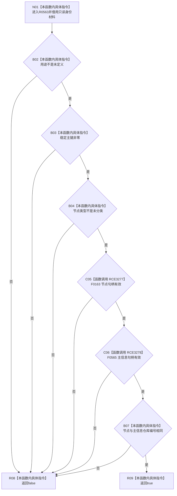

# CF-L7-0081 系统角色身份材料完整现状流程图

图类型：现状流程图
代码版本：`0a93526882cb33c61c2fbb04ecad1aeaddcfe225`
工作区复核基线：`03a8b7ac099ccea83e57f2696e2290b7bcdfacaf`
源码 blob：`c26b12e291f7192b887ef01efce9e6dc157e9cef`
覆盖文件：`海中鱼巣/领域/系统角色清单.数据.h:116-120`
唯一根函数：R0563
完整签名：`bool 海中鱼巣::系统角色身份材料::完整() const noexcept`
参数：无显式参数；隐式 `this` 为 const 非拥有借用
返回结果：用途、稳定主键、节点类型、两个句柄及仓库编号六项依次成立时返回 `true`，否则返回 `false`
已登记调用方：F0458（RCE0232）、R0538（RCE1546）、R0727（RCE2201）、R0335（RCE2725）、R0338（RCE2730）、R0413（RCE2843）、R0414（RCE2848）
直接项目函数：F0163（RCE3277）`句柄有效(const 节点句柄&)`、F0565（RCE3278）`句柄有效(const 主信息句柄&)`
外部边界：无
逐行映射表：`流程图/代码流程图/L7/CF-L7-0081_系统角色身份材料完整_逐行代码映射表.md`
结构读写：只读本材料字段
不得作为施工许可：是
不得宣称：材料完整代表对应节点、主信息或系统角色结构仍在仓库中有效

## 流程图

## 当前边界

- 六项条件按源码 `&&` 从左到右短路；任一失败均不再执行后续检查。
- 两次句柄检查只验证句柄字段的非零自洽性；最后一项只比较仓库编号。
