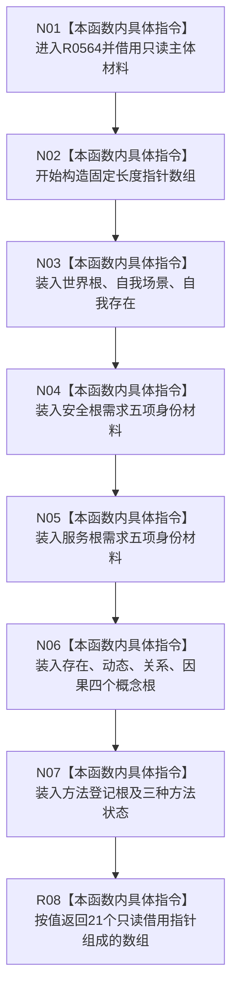

# CF-L7-0082 系统角色主体材料读取身份组现状流程图

图类型：现状流程图
代码版本：`0a93526882cb33c61c2fbb04ecad1aeaddcfe225`
工作区复核基线：`03a8b7ac099ccea83e57f2696e2290b7bcdfacaf`
源码 blob：`c26b12e291f7192b887ef01efce9e6dc157e9cef`
覆盖文件：`海中鱼巣/领域/系统角色清单.数据.h:177-186`
唯一根函数：R0564
完整签名：`std::array<const 系统角色身份材料*, 系统角色稳定键数量> 海中鱼巣::系统角色主体材料::读取身份组() const noexcept`
参数：无显式参数；隐式 `this` 为 const 非拥有借用
返回结果：按固定源码顺序返回 21 个系统角色身份材料的只读借用指针数组
已登记调用方：F0458（RCE0233）、R0415（RCE1296）、R0421（RCE1308）
直接项目函数：无
外部边界：无
逐行映射表：`流程图/代码流程图/L7/CF-L7-0082_系统角色主体材料读取身份组_逐行代码映射表.md`
结构读写：只读取成员地址并形成值式 `std::array`；不复制身份材料
不得作为施工许可：是
不得宣称：返回数组拥有所指材料，或指针在主体材料生命周期结束后仍有效

## 流程图

## 当前边界

- 数组顺序由源码初始化列表固定，调用方可据此与系统角色稳定键用途顺序对应。
- 数组元素均指向当前 `系统角色主体材料` 对象内部；返回数组不延长主体材料生命周期。
