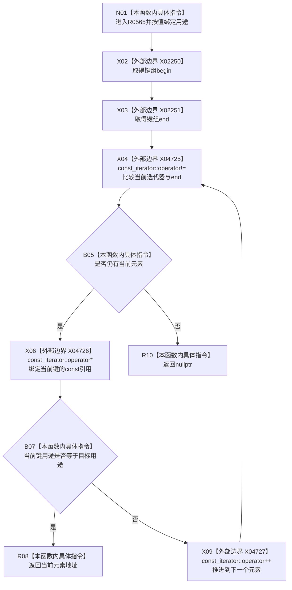

# CF-L7-0083 系统角色预检结果查找现状流程图

图类型：现状流程图
代码版本：`0a93526882cb33c61c2fbb04ecad1aeaddcfe225`
工作区复核基线：`03a8b7ac099ccea83e57f2696e2290b7bcdfacaf`
源码 blob：`c26b12e291f7192b887ef01efce9e6dc157e9cef`
覆盖文件：`海中鱼巣/领域/系统角色清单.数据.h:284-287`
唯一根函数：R0565
完整签名：`const 系统角色键占用材料* 海中鱼巣::系统角色预检结果::查找(系统角色稳定键用途 用途) const noexcept`
参数：`用途` 按值输入；隐式 `this` 为 const 非拥有借用
返回结果：返回键组中首个用途相等元素的只读借用指针；无匹配时返回 `nullptr`
已登记调用方：F0455（RCE0231）、R0230（RCE0796）、R0232（RCE0798）、R0233（RCE0803）、R0234（RCE0806）
直接项目函数：无
外部边界：X02250 `键组.begin()`、X02251 `键组.end()`、X04725 迭代器 `operator!=`、X04726 迭代器 `operator*`、X04727 迭代器 `operator++`
逐行映射表：`流程图/代码流程图/L7/CF-L7-0083_系统角色预检结果查找_逐行代码映射表.md`
结构读写：只读固定数组并借用其中元素
不得作为施工许可：是
不得宣称：返回指针在预检结果销毁、移动或被覆盖后仍有效

## 流程图

## 当前边界

- 范围循环在进入循环时各取得一次 `begin` 与 `end`；每轮含终止轮调用 `operator!=`，有当前元素时调用 `operator*`，未返回时调用 `operator++`。
- 命中后立即返回首个匹配元素地址；本函数不校验同一用途是否重复出现。
