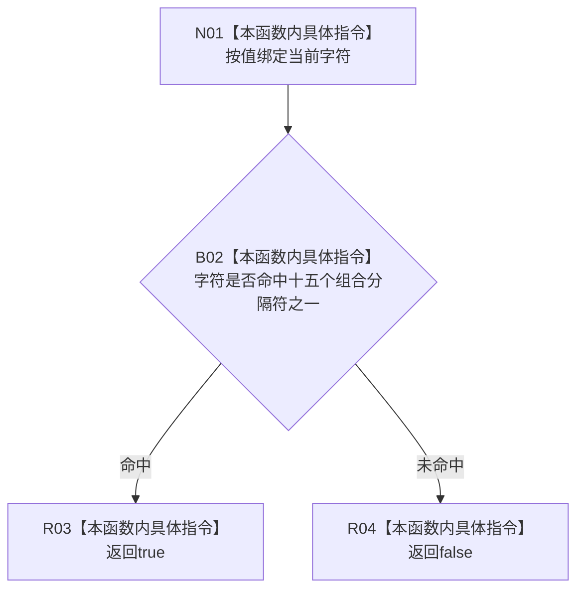

# CF-L7-0085 字符是组合分隔符现状流程图

图类型：现状流程图
代码版本：`0a93526882cb33c61c2fbb04ecad1aeaddcfe225`
工作区复核基线：`03a8b7ac099ccea83e57f2696e2290b7bcdfacaf`
源码 blob：`1355a1afd544cd44c14ee904246e9cb0778fb39b`
覆盖文件：`海中鱼巣/领域/语素服务.h:262-267`
唯一根函数：R0569
完整签名：`bool 海中鱼巣::语素服务::字符是组合分隔符(wchar_t 字符) const`
参数：`字符` 按值输入
返回结果：字符属于 `/ \\ - _ + , . ; : ， 。 ； ： 、` 任一项时返回 `true`，否则返回 `false`
已登记调用方：R0575（RCE1592）
直接项目函数：无
外部边界：无
逐行映射表：`流程图/代码流程图/L7/CF-L7-0085_字符是组合分隔符_逐行代码映射表.md`
结构读写：只读值参数，不修改项目结构
不得作为施工许可：是
不得宣称：未命中列举字符代表文本整体可作为最小词单元

## 流程图

## 当前边界

- 十五项 `||` 按源码顺序从左到右短路。
- 本函数不把空白字符或其它标点自动归为组合分隔符。
