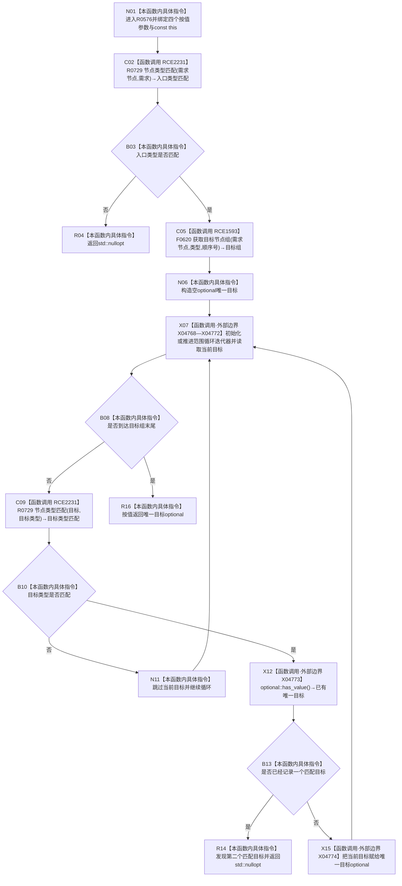

# CF-L7-0086 需求服务读取唯一需求目标现状流程图

图类型：现状流程图
代码版本：`03a8b7ac099ccea83e57f2696e2290b7bcdfacaf`
工作区复核基线：`7edb47f7b58aa71a10c225790e41f1d6c12a0cbd`
源码 blob：`e41b0c665b360232e55ede728f2a4d561c5c9d32`
覆盖文件：`海中鱼巣/领域/需求服务.h:1005-1022`
唯一根函数：R0576
完整签名：`std::optional<节点句柄> 海中鱼巣::需求服务::读取唯一需求目标(节点句柄 需求节点, 关系类型 类型, 节点类型 目标类型, std::int64_t 顺序号) const`
参数：四个显式参数均按值传入；隐式 const `this` 为调用期间有效的非拥有借用
返回结果：需求节点类型不符、没有匹配目标或出现多个匹配目标时返回 `std::nullopt`；恰有一个类型匹配目标时返回该句柄
已登记调用方：F0553（RCE0254）、R0582（RCE1608）、R0583（RCE1609）、R0584（RCE1612）、R0585（RCE1613）
直接项目函数：R0729（RCE2231，两处）、F0620（RCE1593，三参数 `关系仓库::获取目标节点组`）
外部边界：X04768—X04772 范围循环迭代操作；X04773 `optional::has_value()`；X04774 `optional::operator=(节点句柄)`
逐行映射表：`流程图/代码流程图/L7/CF-L7-0086_需求服务读取唯一需求目标_逐行代码映射表.md`
结构读写：只读需求节点类型和满足关系类型、顺序号的目标节点组；不修改节点、关系、需求或索引
逻辑内返回：入口类型不符、无匹配目标或匹配目标不唯一
内部错误：本函数无写后异常分支
生命周期与资源释放：目标组与 optional 为局部值，离开函数时自动释放
不得作为施工许可：是
不得宣称：返回有值证明需求完整、目标关系唯一性已由仓库强制或业务闭环完成

## 流程图

## 当前边界

- F0620 的三参数无令牌重载由接收者静态类型和实参数量唯一确定。
- 循环只把目标类型匹配的节点计入唯一性；类型不匹配节点直接跳过。
- 空目标组与没有类型匹配目标都沿 R16 返回空 optional；第二个匹配目标沿 R14 提前返回空 optional。
