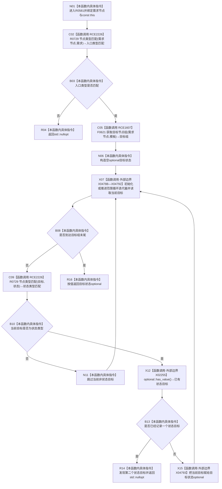

# CF-L7-0087 需求服务读取需求目标状态现状流程图

图类型：现状流程图
代码版本：`03a8b7ac099ccea83e57f2696e2290b7bcdfacaf`
工作区复核基线：`7edb47f7b58aa71a10c225790e41f1d6c12a0cbd`
源码 blob：`e41b0c665b360232e55ede728f2a4d561c5c9d32`
覆盖文件：`海中鱼巣/领域/需求服务.h:353-369`
唯一根函数：R0581
完整签名：`std::optional<节点句柄> 海中鱼巣::需求服务::读取需求目标状态(节点句柄 需求节点) const`
参数：`需求节点` 按值传入；隐式 const `this` 为调用期间有效的非拥有借用
返回结果：入口不是需求节点、没有状态类型模板目标或出现多个状态类型模板目标时返回 `std::nullopt`；恰有一个时返回该状态句柄
已登记调用方：R0249（RCE0844）、R0286（RCE0918）、R0593（RCE1624）、F0552（RCE2224）
直接项目函数：R0729（RCE2226，两处）、F0621（RCE1607，二参数 `关系仓库::获取目标节点组`）
外部边界：X02255 `optional::has_value()`；X04788—X04792 范围循环迭代操作；X04793 `optional::operator=(节点句柄)`
逐行映射表：`流程图/代码流程图/L7/CF-L7-0087_需求服务读取需求目标状态_逐行代码映射表.md`
结构读写：只读需求节点类型及其模板目标节点组；不修改节点、关系、需求或索引
逻辑内返回：入口类型不符、无状态目标或状态目标不唯一
内部错误：本函数无写后异常分支
生命周期与资源释放：目标组与 optional 为局部值，离开函数时自动释放
不得作为施工许可：是
不得宣称：返回有值证明需求完整、状态目标关系由仓库强制唯一或目标状态已发布

## 流程图

## 当前边界

- F0621 的二参数无令牌重载由接收者静态类型和实参数量唯一确定。
- 循环仅把状态类型目标计入唯一性；其它模板目标被跳过。
- 空目标组、没有状态类型目标和多个状态类型目标都产生空 optional，但路径不同。
