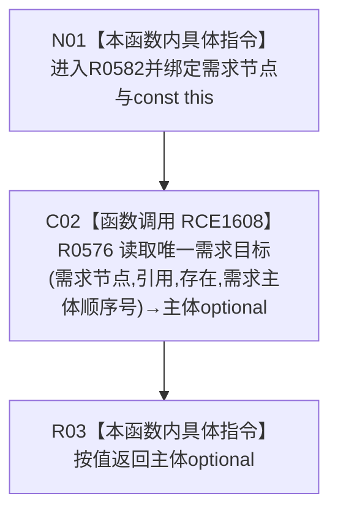

# CF-L7-0088 需求服务读取需求主体现状流程图

图类型：现状流程图
代码版本：`03a8b7ac099ccea83e57f2696e2290b7bcdfacaf`
工作区复核基线：`7edb47f7b58aa71a10c225790e41f1d6c12a0cbd`
源码 blob：`e41b0c665b360232e55ede728f2a4d561c5c9d32`
覆盖文件：`海中鱼巣/领域/需求服务.h:513-515`
唯一根函数：R0582
完整签名：`std::optional<节点句柄> 海中鱼巣::需求服务::读取需求主体(节点句柄 需求节点) const`
参数：`需求节点` 按值传入；隐式 const `this` 为调用期间有效的非拥有借用
返回结果：直接返回 R0576 对引用关系、存在目标类型和需求主体顺序号的唯一目标查询结果
已登记调用方：R0286（RCE0919）、R0583（RCE1610）、F0552（RCE2221）
直接项目函数：R0576（RCE1608）
外部边界：无
逐行映射表：`流程图/代码流程图/L7/CF-L7-0088_需求服务读取需求主体_逐行代码映射表.md`
结构读写：只读需求主体关系；本函数不修改节点、关系、需求或索引
逻辑内返回：由 R0576 将入口类型不符、无匹配或多匹配投影为空 optional
内部错误：本函数无独立错误处理
生命周期与资源释放：被调 optional 结果按值返回
不得作为施工许可：是
不得宣称：返回主体证明需求其它承接材料完整、主体唯一性由仓库强制或需求可执行

## 流程图

## 当前边界

- 本函数是固定关系类型、目标类型和顺序号的薄包装，不增加额外判断。
- 空 optional 的具体原因由 R0576 决定，本函数不区分入口无效、目标缺失或目标不唯一。
- 本函数没有事务令牌，读取的是 R0576 使用的无令牌关系查询路径。
