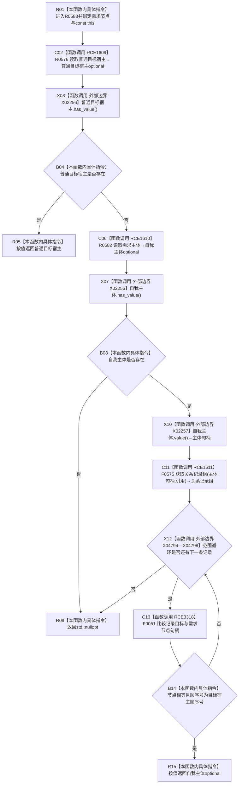

# CF-L7-0089 需求服务读取需求目标宿主现状流程图

图类型：现状流程图
代码版本：`03a8b7ac099ccea83e57f2696e2290b7bcdfacaf`
工作区复核基线：`7edb47f7b58aa71a10c225790e41f1d6c12a0cbd`
源码 blob：`e41b0c665b360232e55ede728f2a4d561c5c9d32`
覆盖文件：`海中鱼巣/领域/需求服务.h:517-533`
唯一根函数：R0583
完整签名：`std::optional<节点句柄> 海中鱼巣::需求服务::读取需求目标宿主(节点句柄 需求节点) const`
参数：`需求节点` 按值传入；隐式 const `this` 为调用期间有效的非拥有借用
返回结果：优先返回需求到存在节点的普通目标宿主；普通目标宿主缺失时，若主体存在且主体到需求节点具有指定反向引用关系则返回主体，否则返回 `std::nullopt`
已登记调用方：R0286（RCE0920）、F0552（RCE2222）
直接项目函数：R0576（RCE1609）、R0582（RCE1610）、F0575（RCE1611，二参数 `关系仓库::获取关系记录组`）、F0051（RCE3318，节点句柄相等比较）
外部边界：X02256 `optional<节点句柄>::has_value()` 两次；X02257 `optional<节点句柄>::value()` 一次；X04794—X04798 范围循环迭代操作
逐行映射表：`流程图/代码流程图/L7/CF-L7-0089_需求服务读取需求目标宿主_逐行代码映射表.md`
结构读写：只读普通目标宿主、需求主体和主体源出的引用关系记录；不修改节点、关系、需求或索引
逻辑内返回：普通宿主与合格反向引用均不存在时返回空 optional
内部错误：本函数无写后异常分支
生命周期与资源释放：两个 optional 和关系记录向量为局部值；循环记录为只读借用
不得作为施工许可：是
不得宣称：返回宿主证明需求承接材料完整、反向关系唯一或两段读取形成事务快照

## 流程图

## 当前边界

- 普通目标宿主优先；只有其 optional 为空时才读取需求主体和反向引用关系。
- F0575 的二参数无令牌重载由接收者静态类型和实参数量唯一确定。
- 反向引用分支返回主体 optional 本身；找到第一条匹配记录即提前返回，不检查是否还有重复记录。
