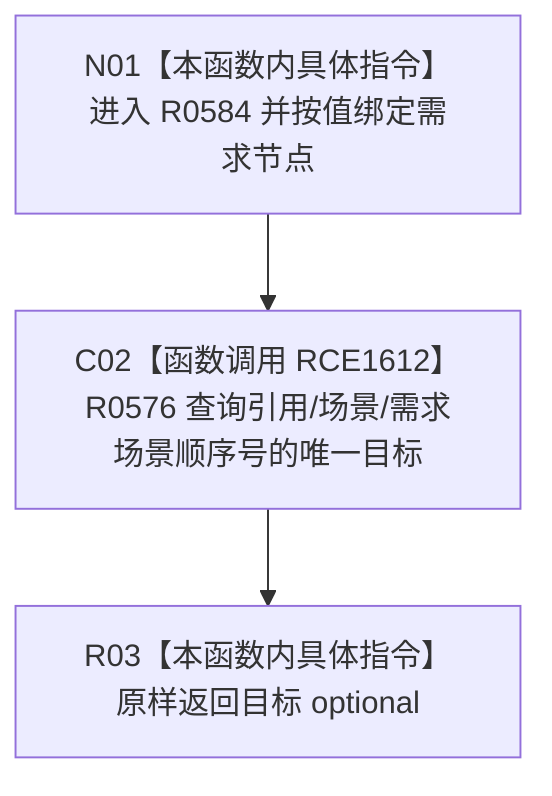

# CF-L7-0090 读取需求场景现状流程图

图类型：现状流程图
代码版本：`03a8b7ac099ccea83e57f2696e2290b7bcdfacaf`
工作区复核基线：`7edb47f7b58aa71a10c225790e41f1d6c12a0cbd`
源码 blob：`e41b0c665b360232e55ede728f2a4d561c5c9d32`
覆盖文件：`海中鱼巣/领域/需求服务.h:539-541`
唯一根函数：R0584
完整签名：`std::optional<节点句柄> 海中鱼巣::需求服务::读取需求场景(节点句柄 需求节点) const`
参数：`需求节点` 按值传入
返回结果：返回 R0576 对需求场景角色的唯一目标查询结果；不存在或不唯一时的空 optional 口径由 R0576 决定
已登记调用方：R0286（RCE0921）、F0552（RCE2223）
直接项目函数：R0576（RCE1612）
外部边界：无
逐行映射表：`流程图/代码流程图/L7/CF-L7-0090_读取需求场景_逐行代码映射表.md`
结构读写：本函数不直接写结构；下沉到 R0576 读取需求节点的引用关系
不得作为施工许可：是
不得宣称：返回场景句柄代表场景内容完整、需求承接材料完整或任何业务能力已完成

## 流程图

## 当前边界

- 本函数只固定关系类型、目标节点类型和顺序号，不在本层检查需求节点类型。
- 空 optional 可能来自目标缺失、类型不匹配或候选不唯一；具体判定由 R0576 的单函数过程展开。
