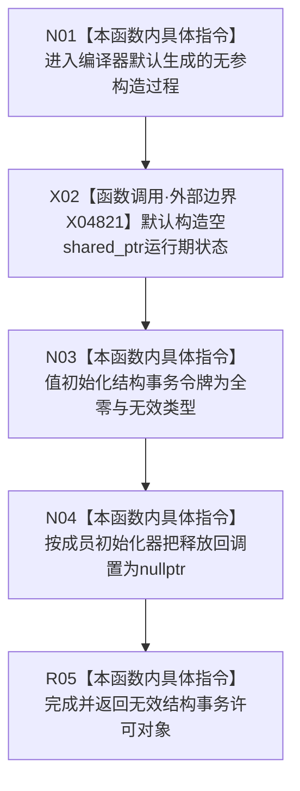

# CF-L7-0091 结构事务许可默认构造现状流程图

图类型：现状流程图
代码版本：`03a8b7ac099ccea83e57f2696e2290b7bcdfacaf`
当前工作区复核基线：`7edb47f7b58aa71a10c225790e41f1d6c12a0cbd`
源码 blob：`9d89cee25f00ba0f721d0b6c1bea517524e40663`
覆盖文件：`海中鱼巣/核心/结构事务接线.数据.h:25`
唯一根函数：R0599
完整签名：`海中鱼巣::结构事务许可::结构事务许可()`
参数：无
返回结果：完成默认构造，形成运行期状态为空、令牌全零且释放回调为空的结构事务许可对象
已登记调用方：R0137（RCE1686）、R0101（RCE2517）
直接项目函数：无
外部边界：X04821（`std::shared_ptr<void>` 默认构造）
逐行映射表：`流程图/代码流程图/L7/CF-L7-0091_结构事务许可默认构造_逐行代码映射表.md`
结构读写：只初始化新对象自身成员，不取得锁、不登记许可、不修改共享结构
不得作为施工许可：是
不得宣称：默认构造对象持有任何结构许可，或已连接运行期事务域

## 流程图

## 当前边界

- `= default` 的运行效果来自成员默认构造和成员初始化器；源码行未取得共享或独占锁。
- `结构事务令牌` 的四个成员均使用其声明处默认值，释放回调使用类内 `nullptr` 初始化器。
- `std::shared_ptr<void>` 默认构造由稳定外部边界 X04821 登记。
