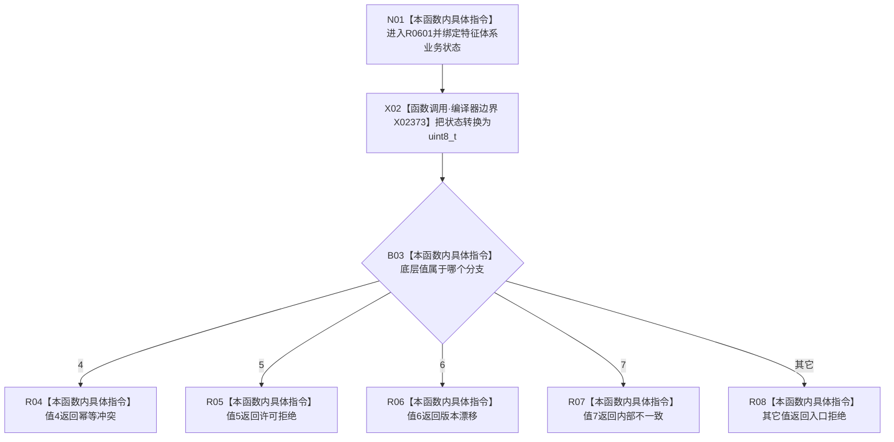

# CF-L7-0092 映射特征体系业务状态现状流程图

图类型：现状流程图
代码版本：`03a8b7ac099ccea83e57f2696e2290b7bcdfacaf`
工作区复核基线：`29c275b9f3fe564bcaba896fb044fa271343614d`
源码 blob：`adf3fb33c53aa5aeaff2f7102bc9a4d7db3ba040`
覆盖文件：`海中鱼巣/领域/初始化.系统角色.ixx:194-202`
唯一根函数：R0601
完整签名：`海中鱼巣::系统角色业务状态 海中鱼巣::系统角色初始化器::映射业务状态<海中鱼巣::特征体系业务状态>(海中鱼巣::特征体系业务状态 状态) noexcept`
参数：`状态` 按值传入，模板实例固定为 `特征体系业务状态`
返回结果：底层值 4、5、6、7 分别映射为幂等冲突、许可拒绝、版本漂移、内部不一致；其它值映射为入口拒绝
已登记调用方：R0229（RCE1687）、F0455（RCE1878）
直接项目函数：无
外部边界：X02373 `static_cast<std::uint8_t>()`
逐行映射表：`流程图/代码流程图/L7/CF-L7-0092_映射特征体系业务状态_逐行代码映射表.md`
结构读写：无；只执行枚举底层值转换与返回映射
逻辑内返回：所有输入值都有确定返回，未列举值统一映射为入口拒绝
内部错误：无
不得作为施工许可：是
不得宣称：入口拒绝能区分未知枚举值、成功状态会由本函数保留或映射结果证明业务已提交

## 流程图

## 当前边界

- 本图只对应 `特征体系业务状态` 模板实例，不与 R0602 的另一模板身份合并。
- `已提交` 等未列举底层值也沿 default 返回入口拒绝。
- 函数是纯映射，不读取或写入系统角色、特征、需求或事务结构。
