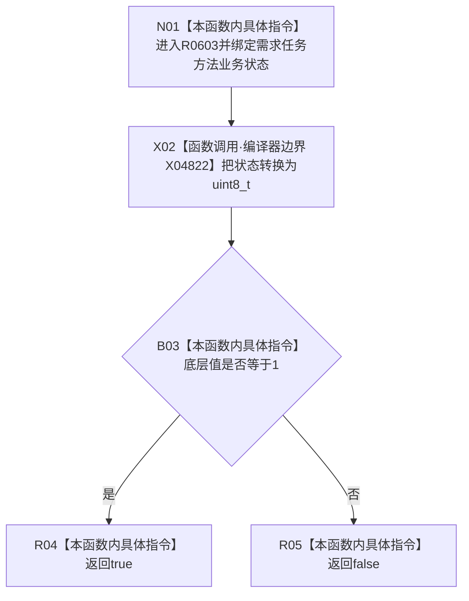

# CF-L7-0094 需求任务方法状态已提交现状流程图

图类型：现状流程图
代码版本：`03a8b7ac099ccea83e57f2696e2290b7bcdfacaf`
工作区复核基线：`29c275b9f3fe564bcaba896fb044fa271343614d`
源码 blob：`adf3fb33c53aa5aeaff2f7102bc9a4d7db3ba040`
覆盖文件：`海中鱼巣/领域/初始化.系统角色.ixx:205-207`
唯一根函数：R0603
完整签名：`bool 海中鱼巣::系统角色初始化器::状态已提交<海中鱼巣::需求任务方法业务状态>(海中鱼巣::需求任务方法业务状态 状态) noexcept`
参数：`状态` 按值传入，模板实例固定为 `需求任务方法业务状态`
返回结果：状态底层值等于 1 时返回 `true`，否则返回 `false`
已登记调用方：R0229（RCE1689）、F0455（RCE2172）
直接项目函数：无
外部边界：X04822 `static_cast<std::uint8_t>()`
逐行映射表：`流程图/代码流程图/L7/CF-L7-0094_需求任务方法状态已提交_逐行代码映射表.md`
结构读写：无；只执行枚举底层值转换与比较
逻辑内返回：任意输入均返回 bool
内部错误：无
不得作为施工许可：是
不得宣称：返回 `true` 证明结构已发布、事务已提交读回或业务闭环完成

## 流程图

## 当前边界

- 本图只对应 `需求任务方法业务状态` 模板实例。
- “已提交”完全由底层值 1 判断，不读取结构、事务、版本或发布证据。
- 函数声明 `noexcept`，没有异常或错误分支。
