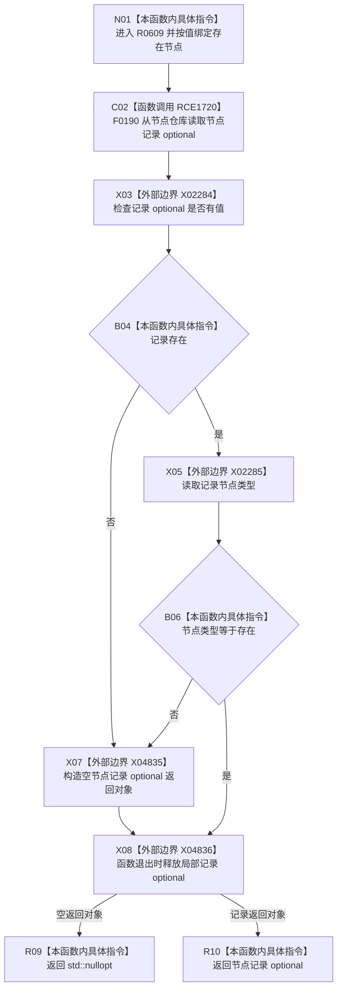

# CF-L7-0095 存在服务读取存在现状流程图

图类型：现状流程图
代码版本：`03a8b7ac099ccea83e57f2696e2290b7bcdfacaf`
工作区复核基线：`29c275b9f3fe564bcaba896fb044fa271343614d`
源码 blob：`045d1eb190f44a38cc129974c2681969fedba9d5`
覆盖文件：`海中鱼巣/领域/存在服务.h:131-137`
唯一根函数：R0609
完整签名：`std::optional<海中鱼巣::节点记录> 海中鱼巣::存在服务::读取存在(海中鱼巣::节点句柄 存在节点) const`
参数：`存在节点` 按值传入
返回结果：节点记录存在且类型为存在时返回该记录 optional，否则返回 `std::nullopt`
已登记调用方：F0365（RCE1711）、F0516（RCE1723）、R0277（RCE1724）
直接项目函数：F0190（RCE1720）
外部边界：X02284 `optional::has_value`、X02285 `optional::operator->`、X04835 `optional(std::nullopt_t)`、X04836 `optional::~optional`
逐行映射表：`流程图/代码流程图/L7/CF-L7-0095_存在服务读取存在_逐行代码映射表.md`
结构读写：只读节点仓库记录，不改变节点、主信息或关系结构
不得作为施工许可：是
不得宣称：返回存在节点记录代表其主信息有效、存在语义完整或能力已经完成

## 流程图

## 当前边界

- 读取失败与读取到非存在类型共用空 optional 返回口径。
- 本函数不检查节点记录中的主信息句柄，也不读取任何存在关系。
- `return 记录` 允许命名返回值优化；没有把可省略的 optional 拷贝构造登记为稳定外部边界。
