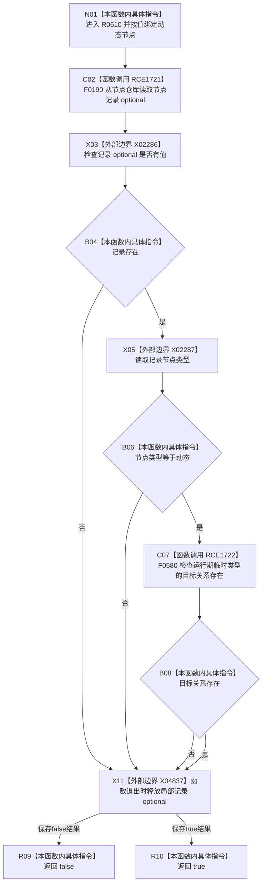

# CF-L7-0096 动态服务动态是否实例动态现状流程图

图类型：现状流程图
代码版本：`03a8b7ac099ccea83e57f2696e2290b7bcdfacaf`
工作区复核基线：`29c275b9f3fe564bcaba896fb044fa271343614d`
源码 blob：`9bb3bb4abf804703b56bb6bc6236f947fafe903a`
覆盖文件：`海中鱼巣/领域/动态服务.h:315-319`
唯一根函数：R0610
完整签名：`bool 海中鱼巣::动态服务::动态是否实例动态(海中鱼巣::节点句柄 动态节点) const`
参数：`动态节点` 按值传入
返回结果：节点记录存在、类型为动态且存在以该节点为目标的运行期临时关系时返回 `true`，否则按 `&&` 短路返回 `false`
已登记调用方：F0366（RCE0146）
直接项目函数：F0190（RCE1721）、F0580（RCE1722）
外部边界：X02286 `optional::has_value`、X02287 `optional::operator->`、X04837 `optional::~optional`
逐行映射表：`流程图/代码流程图/L7/CF-L7-0096_动态服务动态是否实例动态_逐行代码映射表.md`
结构读写：只读节点记录和目标关系存在性，不改变机器结构
不得作为施工许可：是
不得宣称：返回 `true` 代表动态内容、来源、时间或运行状态完整，或能力已经完成

## 流程图

## 当前边界

- 只有节点记录存在且类型为动态时才读取目标关系存在性。
- 本函数只判断至少一条运行期临时目标关系存在，不读取关系数量或来源节点。
