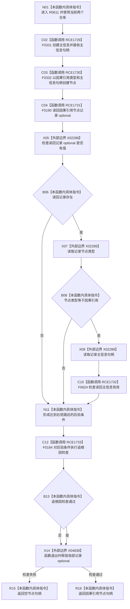

# CF-L7-0097 因果服务记录因果引用现状流程图

图类型：现状流程图
代码版本：`03a8b7ac099ccea83e57f2696e2290b7bcdfacaf`
工作区复核基线：`29c275b9f3fe564bcaba896fb044fa271343614d`
源码 blob：`30a1f0ebe15a1533c6e0c0975cfc1f84344a6984`
覆盖文件：`海中鱼巣/领域/因果服务.h:44-54`
唯一根函数：R0611
完整签名：`海中鱼巣::节点句柄 海中鱼巣::因果服务::记录因果引用()`
参数：无显式参数；使用当前服务持有的主信息仓库与节点仓库
返回结果：创建并读回验证成功时返回因果引用节点句柄；后验检查不成立时返回空句柄
已登记调用方：F0368（RCE1726）
直接项目函数：F0331（RCE1729）、F0332（RCE1730）、F0190（RCE1731）、F0624（RCE1732）、F0184（RCE1733）
外部边界：X02288 `optional::has_value`、X02289 `optional::operator->`、X04838 `optional::~optional`
逐行映射表：`流程图/代码流程图/L7/CF-L7-0097_因果服务记录因果引用_逐行代码映射表.md`
结构读写：创建一条主信息记录和一个因果引用节点，随后只读节点与主信息有效性；失败分支不撤销已创建结构
不得作为施工许可：是
不得宣称：返回有效句柄代表因果关系、来源、目标或业务因果链已经建立，或失败返回没有半结构

## 流程图

## 当前边界

- 主信息和节点创建没有在写入后立即检查句柄；失败会在读回与后验检查中汇合。
- 后验检查失败只返回空句柄，源码范围内没有删除已创建节点或主信息的撤销动作。
