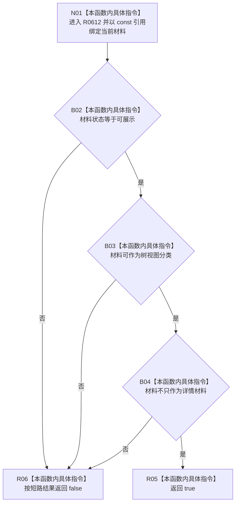

# CF-L7-0098 控制面板树视图材料展示边界谓词现状流程图

图类型：现状流程图
代码版本：`03a8b7ac099ccea83e57f2696e2290b7bcdfacaf`
工作区复核基线：`29c275b9f3fe564bcaba896fb044fa271343614d`
源码 blob：`fe9dad1eb3728c823beccf305c783be96a3df33d`
覆盖文件：`海中鱼巣/界面/控制面板窗口.cpp:397-401`
唯一根函数：R0612
完整签名：`bool 海中鱼巣::控制面板窗口::窗口实现::读取只读材料(bool)::<lambda@控制面板窗口.cpp:397>::operator()(const 海中鱼巣::控制面板树视图材料& 材料) const`
参数：`材料` 以 const 引用借用当前 `std::all_of` 遍历元素
返回结果：材料状态为可展示、允许作为树视图分类且不只作为详情材料时返回 `true`，否则按 `&&` 短路返回 `false`
已登记调用方：F0388 通过 `std::all_of` 回调（RCE1749）
直接项目函数：无
外部边界：无
逐行映射表：`流程图/代码流程图/L7/CF-L7-0098_控制面板树视图材料展示边界谓词_逐行代码映射表.md`
结构读写：只读一项控制面板树视图材料的三个字段，不改变机器结构或界面状态
不得作为施工许可：是
不得宣称：谓词返回 `true` 代表整组树材料、总览材料或控制面板业务事实有效，或能力已经完成

## 流程图

## 当前边界

- 本函数是 `std::all_of` 的局部谓词；算法只对尚未短路的当前元素调用它。
- 本函数不读取树节点内容，也不决定整组材料最终是否通过；整组结果由 F0388 接收。
