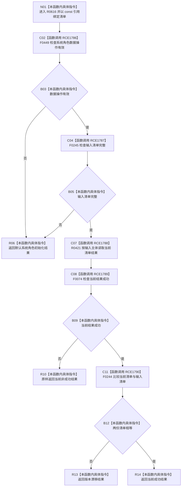

# CF-L7-0099 系统角色数据操作复核系统角色现状流程图

图类型：现状流程图
代码版本：`03a8b7ac099ccea83e57f2696e2290b7bcdfacaf`
工作区复核基线：`29c275b9f3fe564bcaba896fb044fa271343614d`
源码 blob：`b24322d4588808299a232bc308bebd463b7a87a0`
覆盖文件：`海中鱼巣/领域/数据操作.系统角色.ixx:181-187`
唯一根函数：R0616
完整签名：`海中鱼巣::系统角色初始化结果 海中鱼巣::系统角色数据操作::复核系统角色(const 海中鱼巣::系统角色清单& 清单) const`
参数：`清单` 以 const 引用借用
返回结果：数据操作无效或清单不完整时返回默认入口拒绝结果；当前清单读取不成功时原样返回；读取成功但清单不等时返回版本漂移；完全相等时返回当前结果
已登记调用方：F0454（RCE1772）、F0455（RCE1785）
直接项目函数：F0449（RCE1786）、F0245（RCE1787）、R0421（RCE1788）、F0074（RCE1789）、F0244（RCE1790）
外部边界：无
逐行映射表：`流程图/代码流程图/L7/CF-L7-0099_系统角色数据操作复核系统角色_逐行代码映射表.md`
结构读写：只读数据操作有效性、输入清单和当前已发布清单，不改变系统角色结构
不得作为施工许可：是
不得宣称：复核成功代表初始化流程、所有语义或端到端能力已通过验收

## 流程图

## 当前边界

- `清单.完整()` 仅在数据操作有效时求值；入口失败统一返回默认结果。
- 本函数不修复版本漂移，也不发布清单；它只读取并比较当前结构。
