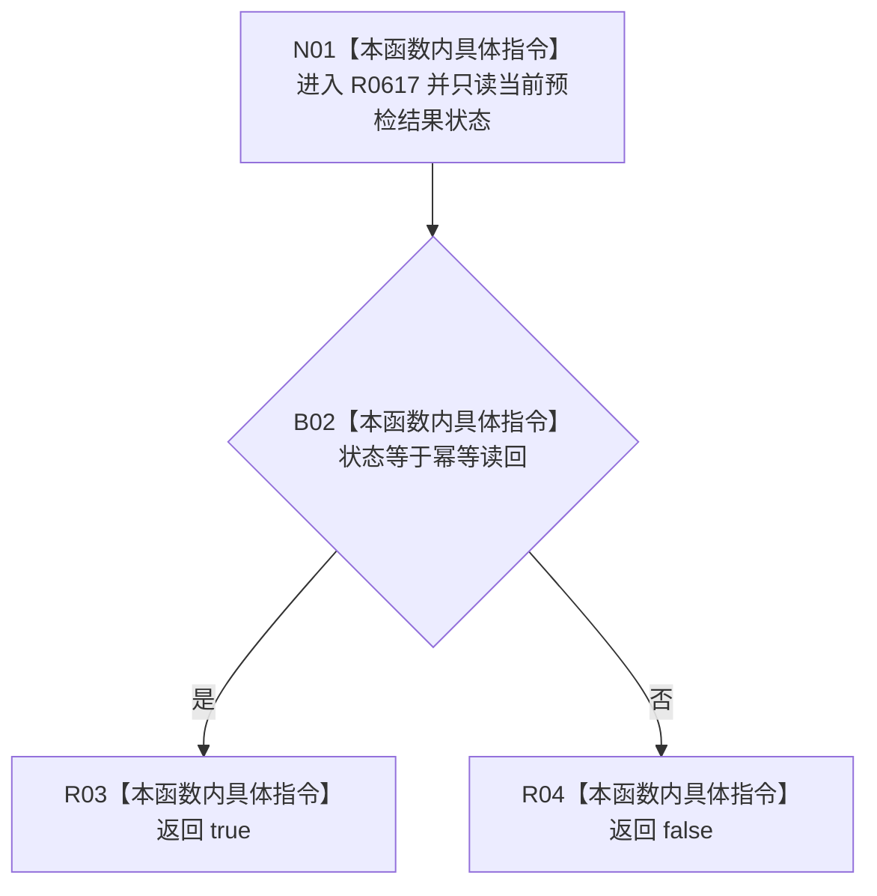

# CF-L7-0100 系统角色预检结果成功现状流程图

图类型：现状流程图
代码版本：`03a8b7ac099ccea83e57f2696e2290b7bcdfacaf`
工作区复核基线：`29c275b9f3fe564bcaba896fb044fa271343614d`
源码 blob：`c26b12e291f7192b887ef01efce9e6dc157e9cef`
覆盖文件：`海中鱼巣/领域/系统角色清单.数据.h:282`
唯一根函数：R0617
完整签名：`bool 海中鱼巣::系统角色预检结果::成功() const noexcept`
参数：无显式参数；只读当前系统角色预检结果
返回结果：状态等于 `系统角色业务状态::幂等读回` 时返回 `true`，否则返回 `false`
已登记调用方：F0455（RCE1776，两个调用点）
直接项目函数：无
外部边界：无
逐行映射表：`流程图/代码流程图/L7/CF-L7-0100_系统角色预检结果成功_逐行代码映射表.md`
结构读写：只读状态字段，不改变键组、关系或系统角色结构
不得作为施工许可：是
不得宣称：返回 `true` 代表后续语义匹配、发布、最终复核或端到端能力已经完成

## 流程图

## 当前边界

- 该成功谓词只承认幂等读回状态；其它所有业务状态均返回 `false`。
- 本函数不检查键组内容或场景接纳自我关系 optional。
