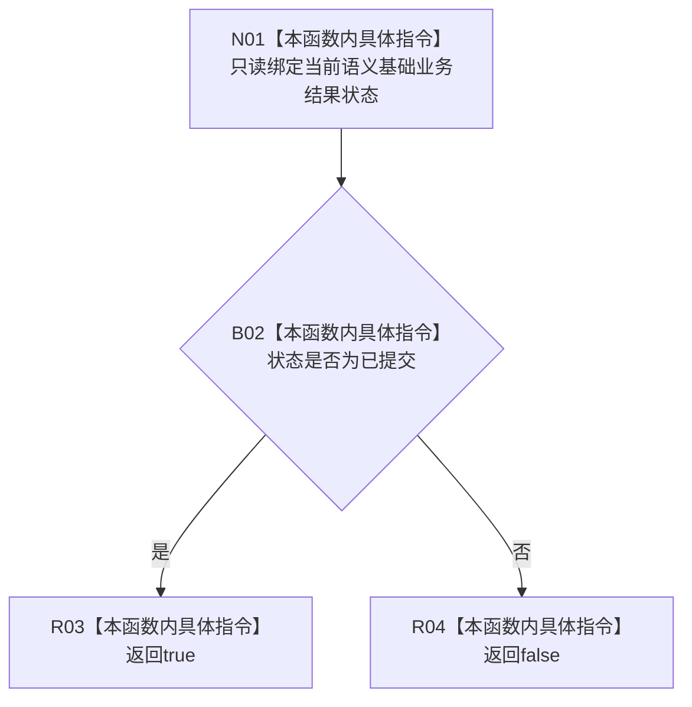

# CF-L7-0102 语义基础业务结果改变结构现状流程图

图类型：现状流程图
代码版本：`03a8b7ac099ccea83e57f2696e2290b7bcdfacaf`
当前工作区复核基线：`29c275b9f3fe564bcaba896fb044fa271343614d`
源码 blob：`ccde9a574e3817b75e3d02c9c8f88e244327c06a`
覆盖文件：`海中鱼巣/领域/数据操作.语素基础.ixx:162-164`
唯一根函数：R0619
完整签名：`bool 海中鱼巣::语义基础业务结果::改变了结构() const noexcept`
参数：无显式参数；只读当前结果对象的 `状态`
返回结果：状态为 `已提交` 时返回 `true`，其它状态返回 `false`
已登记调用方：F0455（RCE1778）
直接项目函数：无
外部边界：无
逐行映射表：`流程图/代码流程图/L7/CF-L7-0102_语义基础业务结果改变结构_逐行代码映射表.md`
结构读写：只读结果状态，本函数自身不修改结构
不得作为施工许可：是
不得宣称：返回 `true` 已证明具体结构差异、发布读回或持久化结果

## 流程图

## 当前边界

- 幂等读回会返回 `false`，即成功与改变结构是两个不同投影。
- 本函数只解释结果状态，不读取或核对具体节点、关系和索引差异。
