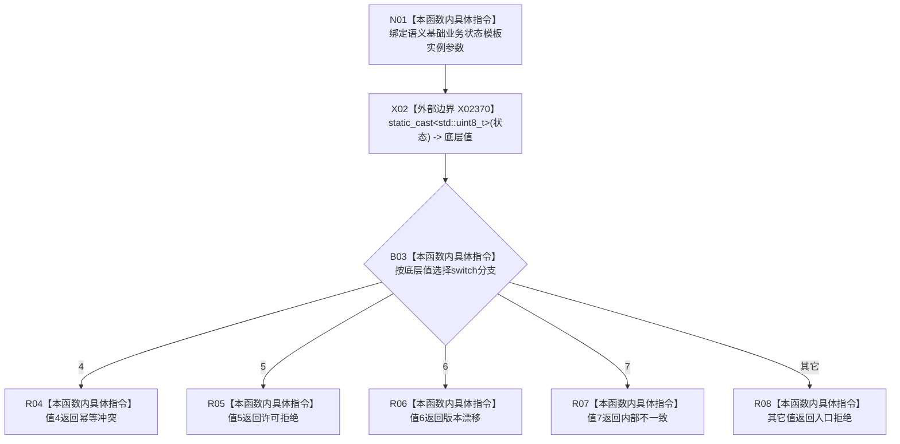

# CF-L7-0103 语义基础业务状态映射现状流程图

图类型：现状流程图
代码版本：`03a8b7ac099ccea83e57f2696e2290b7bcdfacaf`
当前工作区复核基线：`29c275b9f3fe564bcaba896fb044fa271343614d`
源码 blob：`adf3fb33c53aa5aeaff2f7102bc9a4d7db3ba040`
覆盖文件：`海中鱼巣/领域/初始化.系统角色.ixx:193-202`
唯一根函数：R0620
完整签名：`海中鱼巣::系统角色业务状态 海中鱼巣::系统角色初始化器::映射业务状态<海中鱼巣::语义基础业务状态>(海中鱼巣::语义基础业务状态 状态) noexcept`
参数：`状态` 按值输入，本身份固定为 `语义基础业务状态` 模板实例
返回结果：底层值 4、5、6、7 分别映射为幂等冲突、许可拒绝、版本漂移、内部不一致；其它值映射为入口拒绝
已登记调用方：F0455（RCE1779）
直接项目函数：无
外部边界：X02370（把语义基础业务状态显式转换为 `std::uint8_t`）
逐行映射表：`流程图/代码流程图/L7/CF-L7-0103_语义基础业务状态映射_逐行代码映射表.md`
结构读写：只读取值参数并返回枚举，不修改结构
不得作为施工许可：是
不得宣称：未单列的业务状态能够保留原类别，或映射结果已经过运行验证

## 流程图

## 当前边界

- 本模板实例不为 `已提交`、`幂等读回` 等其它底层值保留原状态，统一进入默认的入口拒绝。
- 映射只依赖枚举底层数值，没有结构读取或副作用。
