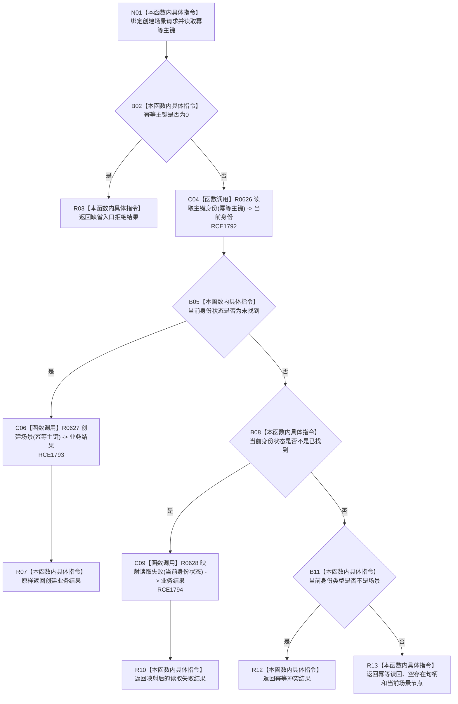

# CF-L7-0104 场景业务服务创建场景现状流程图

图类型：现状流程图
代码版本：`03a8b7ac099ccea83e57f2696e2290b7bcdfacaf`
当前工作区复核基线：`29c275b9f3fe564bcaba896fb044fa271343614d`
源码 blob：`02daea05100474053ac5153e3616a1a6dd74dd0a`
覆盖文件：`海中鱼巣/领域/服务.场景.ixx:28-41`
唯一根函数：R0621
完整签名：`海中鱼巣::存在场景业务结果 海中鱼巣::场景业务服务::创建场景(const 海中鱼巣::创建场景请求& 请求) const`
参数：`请求` 为调用期只读借用，读取其幂等主键
返回结果：零主键返回缺省入口拒绝；未找到时委托创建；读取失败时映射失败；已有非场景类型返回幂等冲突；已有场景返回幂等读回及节点句柄
已登记调用方：F0455（RCE1780）
直接项目函数：R0626（RCE1792）、R0627（RCE1793）、R0628（RCE1794）
外部边界：无
逐行映射表：`流程图/代码流程图/L7/CF-L7-0104_场景业务服务创建场景_逐行代码映射表.md`
结构读写：本函数先只读主键身份；仅未找到分支委托 R0627 执行结构创建
不得作为施工许可：是
不得宣称：返回成功代表持久证据、发布读回或系统角色初始化闭环已验证

## 流程图

## 当前边界

- 只有“主键身份未找到”分支调用 R0627 创建结构；其它分支均零写入。
- 已找到但类型不是场景时返回幂等冲突；已找到场景时返回幂等读回。
- 读取失败的具体状态映射由 R0628 的独立现状图承载。
