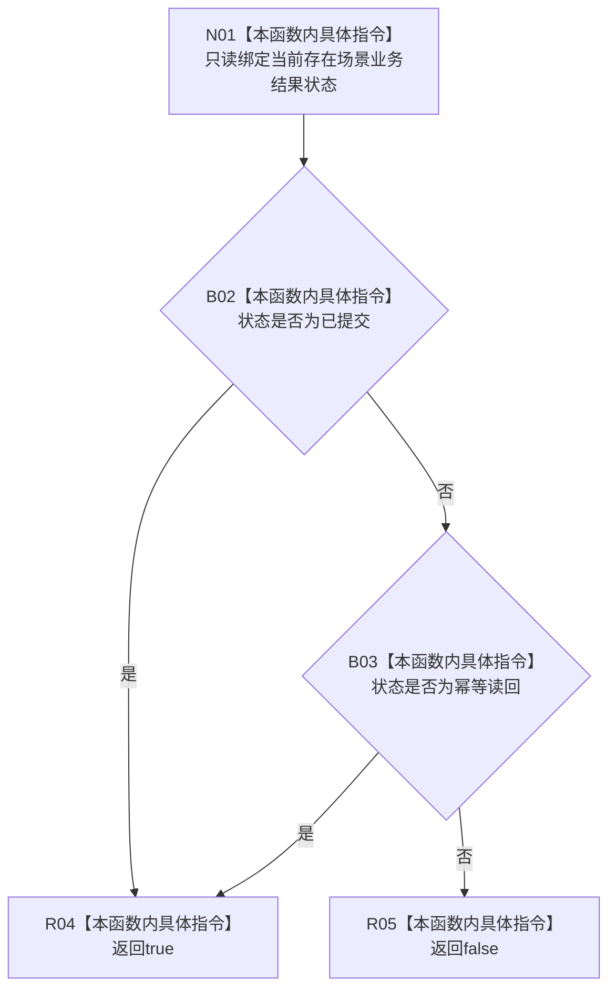

# CF-L7-0105 存在场景业务结果成功现状流程图

图类型：现状流程图
代码版本：`03a8b7ac099ccea83e57f2696e2290b7bcdfacaf`
当前工作区复核基线：`29c275b9f3fe564bcaba896fb044fa271343614d`
源码 blob：`524922ab2f3d0d76cfed4bdd517f0d7d57e1ae6a`
覆盖文件：`海中鱼巣/领域/数据操作.存在场景.ixx:36-39`
唯一根函数：R0622
完整签名：`bool 海中鱼巣::存在场景业务结果::成功() const noexcept`
参数：无显式参数；只读当前结果对象的 `状态`
返回结果：状态为 `已提交` 或 `幂等读回` 时返回 `true`，否则返回 `false`
已登记调用方：F0455（RCE1781）
直接项目函数：无
外部边界：无
逐行映射表：`流程图/代码流程图/L7/CF-L7-0105_存在场景业务结果成功_逐行代码映射表.md`
结构读写：只读结果状态，不修改结构
不得作为施工许可：是
不得宣称：返回 `true` 代表场景或存在结构、关系与持久证据已经独立验证

## 流程图

## 当前边界

- 两项状态比较按源码 `||` 左到右短路。
- `成功` 同时包含首次提交与幂等读回，不区分是否改变结构。
