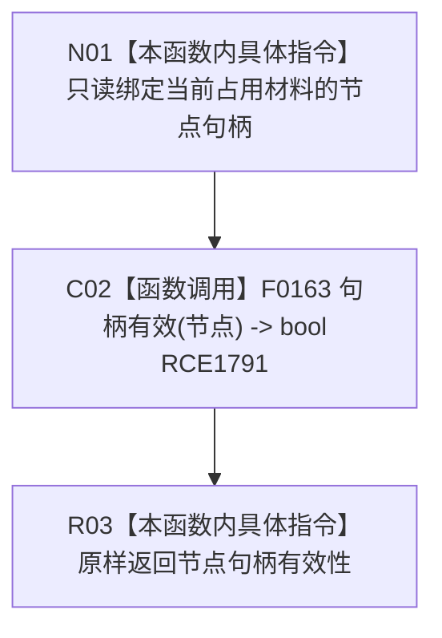

# CF-L7-0108 系统角色键占用材料已占用现状流程图

图类型：现状流程图
代码版本：`03a8b7ac099ccea83e57f2696e2290b7bcdfacaf`
当前工作区复核基线：`29c275b9f3fe564bcaba896fb044fa271343614d`
源码 blob：`c26b12e291f7192b887ef01efce9e6dc157e9cef`
覆盖文件：`海中鱼巣/领域/系统角色清单.数据.h:274`
唯一根函数：R0625
完整签名：`bool 海中鱼巣::系统角色键占用材料::已占用() const noexcept`
参数：无显式参数；只读当前材料的节点句柄
返回结果：节点句柄的仓库编号、节点编号和版本号均非零时返回 `true`，否则返回 `false`
已登记调用方：F0455（RCE1784）、R0422（RCE2870）
直接项目函数：F0163（RCE1791）
外部边界：无
逐行映射表：`流程图/代码流程图/L7/CF-L7-0108_系统角色键占用材料已占用_逐行代码映射表.md`
结构读写：只读值式节点句柄，不读取仓库、不修改结构
不得作为施工许可：是
不得宣称：句柄有效代表对应节点存在、类型正确、版本当前或稳定键占用已经验证

## 流程图

## 当前边界

- 本函数只检查值式句柄三个身份字段非零，不查询节点仓库。
- 用途、稳定主键、预期类型和主信息句柄均不参与 `已占用` 判断。
