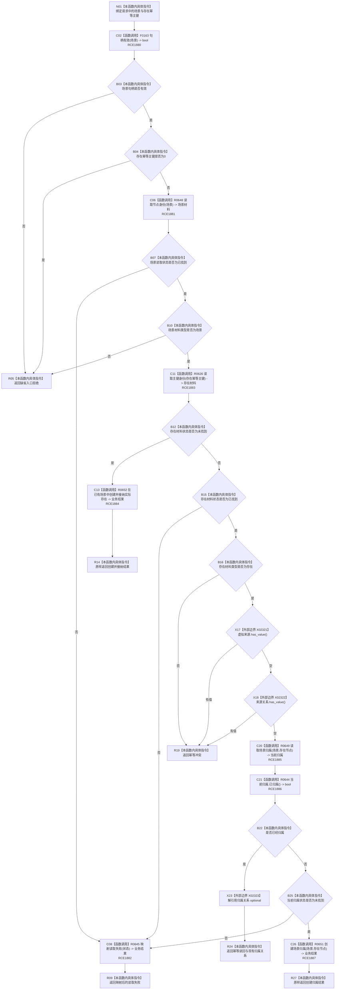

# CF-L7-0109 已有场景创建并接纳实际存在现状流程图

图类型：现状流程图
代码版本：`03a8b7ac099ccea83e57f2696e2290b7bcdfacaf`
当前工作区复核基线：`7cbd2167eb5f6d495f48657a0e5badb07c52a358`
源码 blob：`1d157bb53bf56bf94ae8b546b40965036b61c087`
覆盖文件：`海中鱼巣/领域/组合.存在场景.ixx:24-56`
唯一根函数：R0643
完整签名：`海中鱼巣::存在场景业务结果 海中鱼巣::存在场景组合器::在已有场景中创建并接纳实际存在(const 海中鱼巣::已有场景创建并接纳实际存在请求& 请求) const`
参数：`请求` 为调用期只读借用，含场景句柄与存在幂等主键
返回结果：入口拒绝、映射读取失败、幂等冲突、幂等读回，或原样返回创建实际存在/创建场景归属结果
调用图：`流程图/主程序可达调用关系/01_main可达项目调用边表.md`
输入契约 / 调用语境表：本图“当前边界”节；未另建独立表
非成功返回二分审查表：本图返回节点与“当前边界”节；未另建独立表
偏差清单：无 / 不适用；本图只登记当前实现事实
依据提交 / 结构化消息：源码冻结 `03a8b7ac099ccea83e57f2696e2290b7bcdfacaf`；无结构化执行消息
验证输出：配对逐行映射、节点集合、源码 blob 与本批机械审计
已登记调用方：F0455（RCE1863）
直接项目函数：F0163（RCE1880）、R0648（RCE1881）、R0645（RCE1882）、R0626（RCE1883）、R0652（RCE1884）、R0649（RCE1885）、R0644（RCE1886）、R0651（RCE1887）
外部边界：X02321、X02322（optional `has_value`）、X02323（关系句柄 optional 解引用）
逐行映射表：`流程图/代码流程图/L7/CF-L7-0109_已有场景创建并接纳实际存在_逐行代码映射表.md`
结构读写：组合器只编排；结构变化只可能由 R0652 或 R0651 执行
不得作为施工许可：是
不得宣称：任一成功结果已通过持久读回或初始化闭环验证

## 流程图

## 当前边界

- 组合器先验证场景，再按存在幂等主键区分创建、冲突、读回或补建归属。
- 已找到的存在若带虚拟来源或来源关系即返回幂等冲突，不会复用为实际存在。
- 本函数不直接持有事务或仓库。
