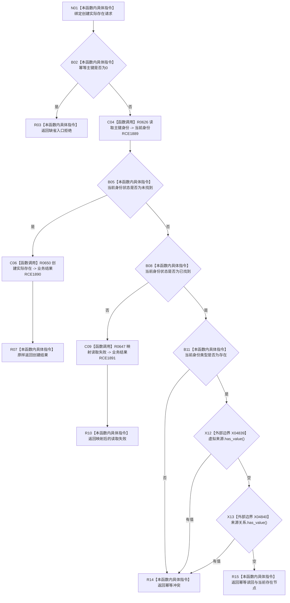

# CF-L7-0110 存在业务服务创建实际存在现状流程图

图类型：现状流程图
代码版本：`03a8b7ac099ccea83e57f2696e2290b7bcdfacaf`
当前工作区复核基线：`7cbd2167eb5f6d495f48657a0e5badb07c52a358`
源码 blob：`379bac36761433211580ce9122b35f10cafe0c8d`
覆盖文件：`海中鱼巣/领域/服务.存在.ixx:52-67`
唯一根函数：R0646
完整签名：`海中鱼巣::存在场景业务结果 海中鱼巣::存在业务服务::创建实际存在(const 海中鱼巣::创建实际存在请求& 请求) const`
参数：`请求` 为调用期只读借用，读取幂等主键
返回结果：零主键入口拒绝；未找到时委托创建；读取失败时映射；已有虚拟或非存在类型时幂等冲突；已有实际存在时幂等读回
调用图：`流程图/主程序可达调用关系/01_main可达项目调用边表.md`
输入契约 / 调用语境表：本图“当前边界”节；未另建独立表
非成功返回二分审查表：本图返回节点与“当前边界”节；未另建独立表
偏差清单：无 / 不适用；本图只登记当前实现事实
依据提交 / 结构化消息：源码冻结 `03a8b7ac099ccea83e57f2696e2290b7bcdfacaf`；无结构化执行消息
验证输出：配对逐行映射、节点集合、源码 blob 与本批机械审计
已登记调用方：F0455（RCE1864）
直接项目函数：R0626（RCE1889）、R0650（RCE1890）、R0647（RCE1891）
外部边界：X04839（节点 optional `has_value`）、X04840（关系 optional `has_value`）
逐行映射表：`流程图/代码流程图/L7/CF-L7-0110_存在业务服务创建实际存在_逐行代码映射表.md`
结构读写：仅未找到分支委托 R0650 创建结构，其余分支零写入
不得作为施工许可：是
不得宣称：返回成功已证明持久化、发布读回或初始化闭环

## 流程图

## 当前边界

- 已找到的存在只有在类型为存在且两个来源 optional 均为空时才幂等读回。
- 本函数不直接操作事务或仓库。
