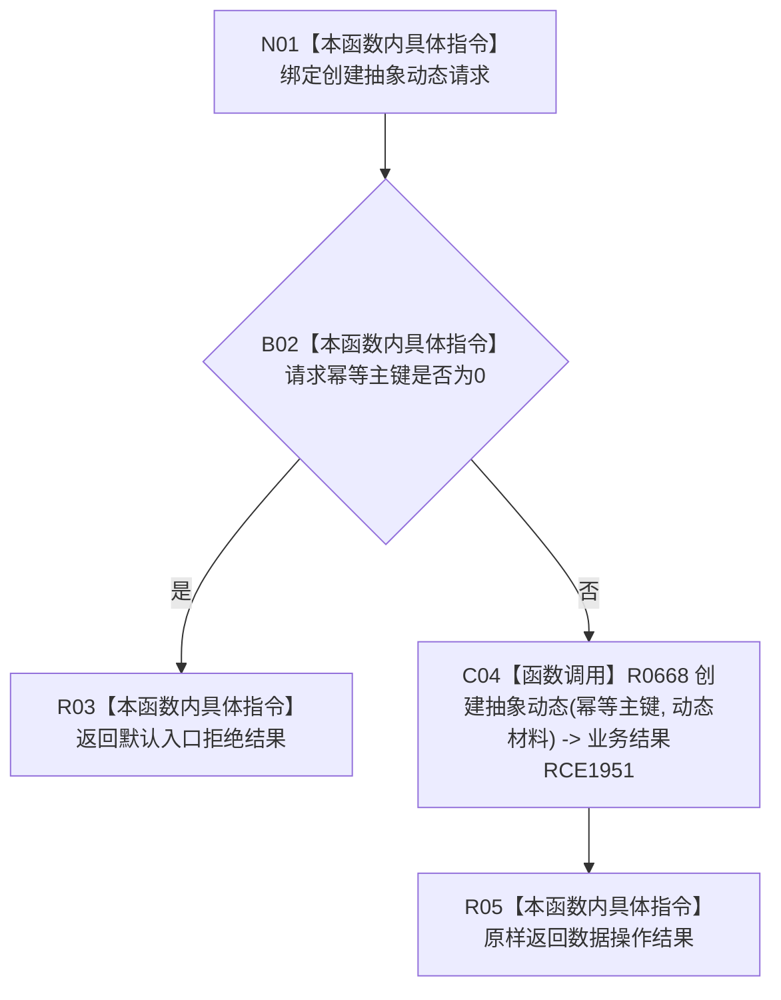

# CF-L7-0111 动态业务服务创建抽象动态现状流程图

图类型：现状流程图
代码版本：`03a8b7ac099ccea83e57f2696e2290b7bcdfacaf`
当前工作区复核基线：`f19e4b0e001554d25b1cf0847dbcfb0b52d4e22c`
源码 blob：`23dc70065c2b5f1de58cb44e3e1de1294e7cf1eb`
覆盖文件：`海中鱼巣/领域/服务.动态.ixx:34-37`
唯一根函数：R0657
完整签名：`海中鱼巣::状态动态业务结果 海中鱼巣::动态业务服务::创建抽象动态(const 海中鱼巣::创建抽象动态请求& 请求) const`
参数：`请求` 以 const 引用输入并由调用方保持有效
返回结果：幂等主键为0返回默认入口拒绝；否则原样返回 R0668 的创建结果
调用图：`流程图/主程序可达调用关系/01_main可达项目调用边表.md`
输入契约 / 调用语境表：本图“当前边界”节；未另建独立表
非成功返回二分审查表：本图返回节点与“当前边界”节；未另建独立表
偏差清单：无 / 不适用；本图只登记当前实现事实
依据提交 / 结构化消息：源码冻结 `03a8b7ac099ccea83e57f2696e2290b7bcdfacaf`；无结构化执行消息
验证输出：配对逐行映射、节点集合、源码 blob 与本批机械审计
已登记调用方：F0455（RCE1865）
直接项目函数：R0668（RCE1951）
外部边界：无
逐行映射表：`流程图/代码流程图/L7/CF-L7-0111_动态业务服务创建抽象动态_逐行代码映射表.md`
结构读写：入口只读请求；非0主键分支委托 R0668 处理动态结构
不得作为施工许可：是
不得宣称：请求材料已完整，或创建结果已经过运行验证

## 流程图

## 当前边界

- 本服务入口只检查幂等主键非0，不在本函数内验证动态材料的其它字段。
