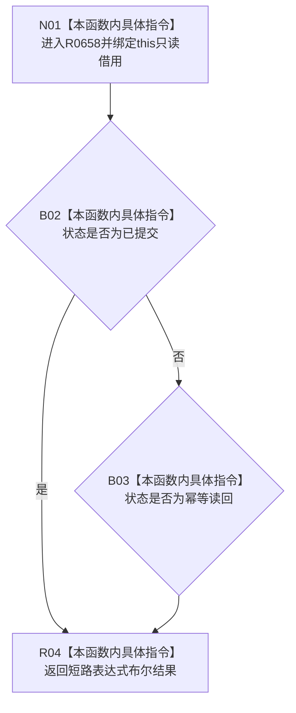

# CF-L7-0112 状态动态业务结果成功现状流程图

图类型：现状流程图
代码版本：`03a8b7ac099ccea83e57f2696e2290b7bcdfacaf`
当前工作区复核基线：`f19e4b0e001554d25b1cf0847dbcfb0b52d4e22c`
源码 blob：`cc399ea69282bf3ae0b0d59c7f0b587e5164b187`
覆盖文件：`海中鱼巣/领域/数据操作.状态动态.ixx:187-190`
唯一根函数：R0658
完整签名：`bool 海中鱼巣::状态动态业务结果::成功() const noexcept`
参数：隐式 `this` 为调用期间有效的非拥有只读借用
返回结果：状态为已提交或幂等读回时返回 `true`，否则返回 `false`
已登记调用方：F0455（RCE1866）
直接项目函数：无
外部边界：无
逐行映射表：`流程图/代码流程图/L7/CF-L7-0112_状态动态业务结果成功_逐行代码映射表.md`
调用图：`流程图/主程序可达调用关系/01_main可达项目调用边表.md`；本函数仅有入边 RCE1866
输入契约 / 调用语境表：本图参数、返回结果和“当前边界”内嵌审查；无独立文件
非成功返回二分审查表：本图逻辑内返回和“当前边界”内嵌审查；无独立文件
偏差清单：本函数当前代码事实未发现需单列偏差；无独立文件
依据提交 / 结构化消息：冻结代码提交 `03a8b7ac099ccea83e57f2696e2290b7bcdfacaf`；流程图维护切片复核基线 `f19e4b0e001554d25b1cf0847dbcfb0b52d4e22c`
验证输出：逐行覆盖、Mermaid/节点集合与未跟踪文件差异检查通过；`check_specs.py --strict` 为 108/108 PASS
结构读写：只读状态字段
逻辑内返回：非已提交且非幂等读回时返回 `false`
内部错误：内部不一致等状态不会在本函数内再分类
生命周期与资源释放：无资源获取
不得作为施工许可：是
不得宣称：返回 `true` 等于本次调用一定改变了结构

## 流程图

## 当前边界

- 第 188—189 行按 `||` 短路；已提交时不再比较幂等读回。
- 成功口径包含幂等读回，因此不能据此推断本次改变了结构。
