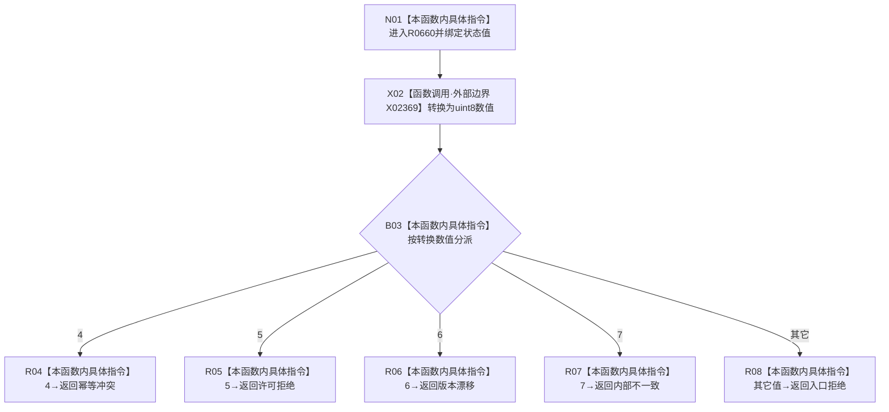

# CF-L7-0114 系统角色初始化器映射状态动态业务状态现状流程图

图类型：现状流程图
代码版本：`03a8b7ac099ccea83e57f2696e2290b7bcdfacaf`
当前工作区复核基线：`f19e4b0e001554d25b1cf0847dbcfb0b52d4e22c`
源码 blob：`adf3fb33c53aa5aeaff2f7102bc9a4d7db3ba040`
覆盖文件：`海中鱼巣/领域/初始化.系统角色.ixx:193-202`
唯一根函数：R0660
完整签名：`海中鱼巣::系统角色业务状态 海中鱼巣::系统角色初始化器::映射业务状态<海中鱼巣::状态动态业务状态>(海中鱼巣::状态动态业务状态 状态) noexcept`
参数：`状态` 按值传入；模板参数冻结为状态动态业务状态
返回结果：底层数值 4、5、6、7 分别映射为幂等冲突、许可拒绝、版本漂移、内部不一致；其它值映射为入口拒绝
已登记调用方：F0455（RCE1876）
直接项目函数：无
外部边界：X02369（枚举到 `std::uint8_t` 的编译器转换）
逐行映射表：`流程图/代码流程图/L7/CF-L7-0114_系统角色初始化器映射状态动态业务状态_逐行代码映射表.md`
调用图：`流程图/主程序可达调用关系/01_main可达项目调用边表.md` 与 `02_main可达外部边界表.md`；入边 RCE1876，外部边界 X02369
输入契约 / 调用语境表：本图参数、返回结果和“当前边界”内嵌审查；无独立文件
非成功返回二分审查表：本图五类返回和“当前边界”内嵌审查；无独立文件
偏差清单：本函数当前代码事实未发现需单列偏差；无独立文件
依据提交 / 结构化消息：冻结代码提交 `03a8b7ac099ccea83e57f2696e2290b7bcdfacaf`；流程图维护切片复核基线 `f19e4b0e001554d25b1cf0847dbcfb0b52d4e22c`
验证输出：逐行覆盖、Mermaid/节点集合与未跟踪文件差异检查通过；`check_specs.py --strict` 为 108/108 PASS
结构读写：无，只进行状态转换
逻辑内返回：入口拒绝、幂等冲突、许可拒绝、版本漂移
内部错误：数值 7 映射为内部不一致
生命周期与资源释放：无资源获取
不得作为施工许可：是
不得宣称：default 只接收入口拒绝枚举；任何未列值都会进入该分支

## 流程图

## 当前边界

- 该模板特化依赖枚举底层数值，而不是具名枚举 case。
- default 对所有未列数值统一映射入口拒绝，图不将其缩窄为某一个枚举成员。
