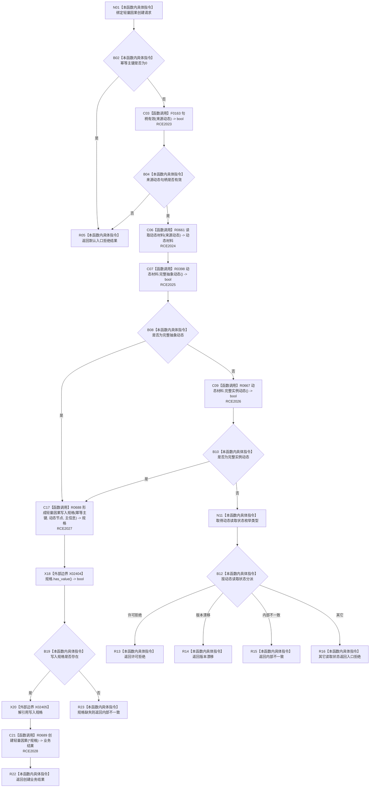

# CF-L7-0115 轻量因果业务服务创建轻量因果现状流程图

图类型：现状流程图
代码版本：`03a8b7ac099ccea83e57f2696e2290b7bcdfacaf`
当前工作区复核基线：`9128ad4375a977d2744b00fcd6f9788d73b4aa7d`
源码 blob：`212fc1b447164eeebf24fd927f240476a2805699`
覆盖文件：`海中鱼巣/领域/服务.轻量因果.ixx:25-42`
唯一根函数：R0680
完整签名：`海中鱼巣::轻量因果业务结果 海中鱼巣::轻量因果业务服务::创建轻量因果(const 海中鱼巣::创建轻量因果请求& 请求) const`
参数：`请求` 为只读引用，提供非零幂等主键和有效来源动态句柄
返回结果：非法入口返回默认入口拒绝；来源读取失败按状态映射；规格形成失败返回内部不一致；规格有效时返回 R0689 的创建结果
调用图：`流程图/主程序可达调用关系/01_main可达项目调用边表.md`
逐行映射表：`流程图/代码流程图/L7/CF-L7-0115_轻量因果业务服务创建轻量因果_逐行代码映射表.md`
输入契约 / 调用语境表：本图“当前边界”节；未另建独立表
非成功返回二分审查表：主键或句柄非法及来源材料不可用按入口/读取状态返回；规格形成失败按内部不一致返回
偏差清单：无 / 不适用；本图只登记当前实现事实
依据提交 / 结构化消息：源码冻结 `03a8b7ac099ccea83e57f2696e2290b7bcdfacaf`；无结构化执行消息
验证输出：配对逐行映射、节点集合、源码 blob 与本批机械审计
已登记调用方：F0455（RCE1868）
直接项目函数：F0163、R0661、R0398、R0667、R0688、R0689（RCE2023—RCE2028）
外部边界：X02404、X02405（检查并解引用可选写入规格）
结构读写：先只读来源动态材料；规格有效后委托 R0689 执行轻量因果结构写入
不得作为施工许可：是
不得宣称：来源动态一定完整、规格必然形成、委托创建必然提交，或调用路径已经过运行验证

## 流程图

## 当前边界

- F0455 以系统角色初始化材料调用本函数；本函数仍自行拒绝零主键和无效来源动态句柄。
- 完整抽象动态或完整实例动态均可进入规格形成；读取材料不完整时只映射读取状态，不尝试结构写入。
- 规格缺失发生在来源材料已完整之后，因此当前代码把它收口为内部不一致。
