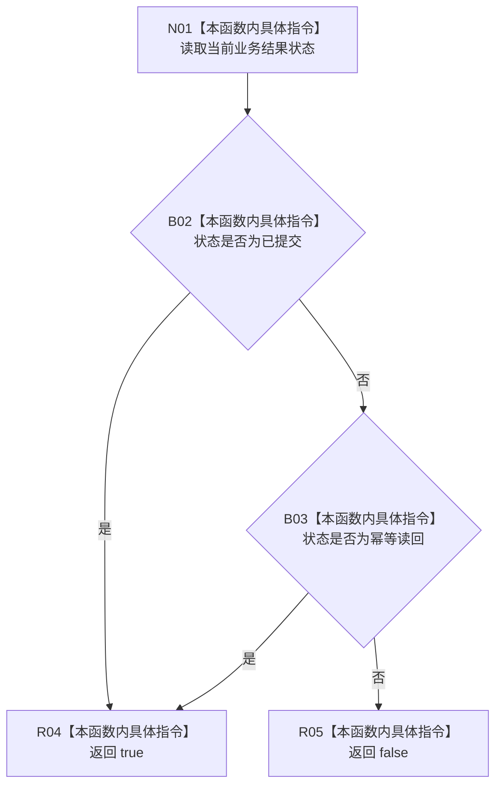

# CF-L7-0116 轻量因果业务结果成功现状流程图

图类型：现状流程图
代码版本：`03a8b7ac099ccea83e57f2696e2290b7bcdfacaf`
当前工作区复核基线：`9128ad4375a977d2744b00fcd6f9788d73b4aa7d`
源码 blob：`fdc9a1b062b28feffec733dd1a0e342812ef1ddc`
覆盖文件：`海中鱼巣/领域/数据操作.轻量因果.ixx:57-60`
唯一根函数：R0681
完整签名：`bool 海中鱼巣::轻量因果业务结果::成功() const noexcept`
参数：无显式参数；只读当前结果对象的 `状态`
返回结果：状态为已提交或幂等读回时返回 true，否则返回 false
调用图：`流程图/主程序可达调用关系/01_main可达项目调用边表.md`
逐行映射表：`流程图/代码流程图/L7/CF-L7-0116_轻量因果业务结果成功_逐行代码映射表.md`
输入契约 / 调用语境表：本图“当前边界”节；未另建独立表
非成功返回二分审查表：false 仅表示结果状态不属于两个成功枚举，不改变原状态语义
偏差清单：无 / 不适用；本图只登记当前实现事实
依据提交 / 结构化消息：源码冻结 `03a8b7ac099ccea83e57f2696e2290b7bcdfacaf`；无结构化执行消息
验证输出：配对逐行映射、节点集合、源码 blob 与本批机械审计
已登记调用方：F0455（RCE1869）
直接项目函数：无
外部边界：无
结构读写：只读业务结果状态，不改变结构或结果对象
不得作为施工许可：是
不得宣称：true 一定代表本次调用新提交了结构，或该状态已经过运行读回验证

## 流程图

## 当前边界

- F0455 使用本谓词判断轻量因果创建结果是否属于成功集合。
- 幂等读回与已提交都返回 true，但只有已提交表明本次结果状态记录为结构改变；本函数不自行检查持久结构。
