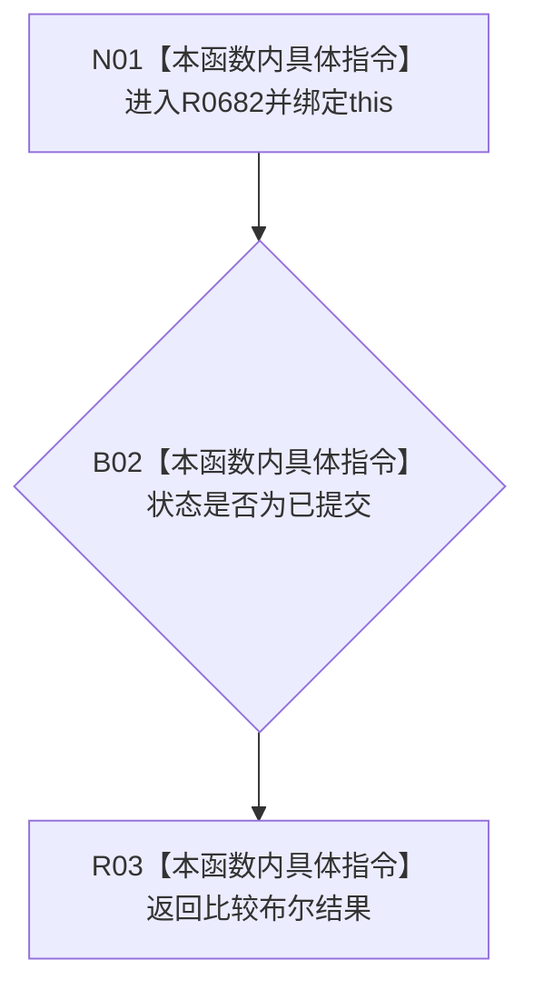

# CF-L7-0117 轻量因果业务结果改变结构现状流程图

图类型：现状流程图
代码版本：`03a8b7ac099ccea83e57f2696e2290b7bcdfacaf`
工作区复核基线：`9128ad4375a977d2744b00fcd6f9788d73b4aa7d`
源码 blob：`fdc9a1b062b28feffec733dd1a0e342812ef1ddc`
覆盖文件：`海中鱼巣/领域/数据操作.轻量因果.ixx:62-64`
唯一根函数：R0682
完整签名：`bool 海中鱼巣::轻量因果业务结果::改变了结构() const noexcept`
参数：隐式 `this` 为调用期间有效的非拥有只读借用
返回结果：仅状态为已提交时返回 `true`，其它状态返回 `false`
调用图：`流程图/主程序可达调用关系/01_main可达项目调用边表.md`；仅有入边 RCE1870
逐行映射表：`流程图/代码流程图/L7/CF-L7-0117_轻量因果业务结果改变结构_逐行代码映射表.md`
输入契约 / 调用语境表：本图参数、返回结果和当前边界内嵌审查；无独立文件
非成功返回二分审查表：非已提交返回 `false` 为当前投影结果；无独立文件
偏差清单：当前代码事实未发现需单列偏差；无独立文件
依据提交 / 结构化消息：冻结代码提交 `03a8b7ac099ccea83e57f2696e2290b7bcdfacaf`；维护切片复核基线 `9128ad4375a977d2744b00fcd6f9788d73b4aa7d`
验证输出：逐行覆盖、Mermaid/节点集合、稳定 ID、无 HTML 与差异格式检查均通过；strict 108/108 PASS
不得作为施工许可：是
不得宣称：返回 `false` 等于业务失败；幂等读回也不改变结构
结构读写：只读状态字段
逻辑内返回：非已提交时返回 `false`
内部错误：不区分非已提交状态的具体原因
生命周期与资源释放：无资源获取

## 流程图

## 当前边界

- 本函数投影是否改变结构，不等同于业务成功口径。
