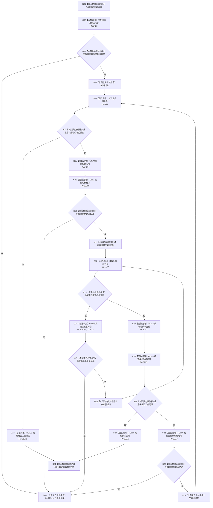

# CF-L7-0118 二次特征业务服务创建组合二次特征现状流程图

图类型：现状流程图
代码版本：`03a8b7ac099ccea83e57f2696e2290b7bcdfacaf`
当前工作区复核基线：`9128ad4375a977d2744b00fcd6f9788d73b4aa7d`
源码 blob：`bf7807b3aedfa3586c4cd5f1be0ae23abe9fe35b`
覆盖文件：`海中鱼巣/领域/服务.二次特征.ixx:24-38`
唯一根函数：R0697
完整签名：`海中鱼巣::特征体系业务结果 海中鱼巣::二次特征业务服务::创建组合二次特征(const 海中鱼巣::创建组合二次特征请求& 请求) const`
参数：`请求` 只读借用；包含非零幂等主键和非空有序组成项组
返回结果：入口拒绝默认结果、身份读取失败映射结果，或数据操作创建组合二次特征的业务结果
调用图：`流程图/主程序可达调用关系/00_main可达函数身份表.md`、`01_main可达项目调用边表.md`、`02_main可达外部边界表.md`
已登记调用方：F0455（RCE1871）
直接项目函数：F0163（RCE2069）、F0051（RCE2070）、R0383（RCE2071）、R0388（RCE2072）、R0699（RCE2073）、R0698（RCE2074）、R0701（RCE2075）
外部边界：X02421—X02423
逐行映射表：`流程图/代码流程图/L7/CF-L7-0118_二次特征业务服务创建组合二次特征_逐行代码映射表.md`
输入契约 / 调用语境表：本图内嵌审查；外部请求需提供非零主键、非空、无重复且类型允许的组成项
非成功返回二分审查表：本图内嵌审查；请求材料不合法为入口拒绝，已进入身份读取后的失败经 R0699 映射
偏差清单：无独立文件；本批只记录当前代码事实
依据提交 / 结构化消息：冻结源码提交 `03a8b7ac099ccea83e57f2696e2290b7bcdfacaf` 与正式稳定边表
验证输出：Mermaid / 节点集合 / 逐行覆盖 PASS；目标 no-index 与全仓 diff 检查 PASS；strict 108/108 PASS；未构建、未运行
不得作为施工许可：是
不得宣称：组成项长期有效、组合已创建或已经完成集成验收

## 流程图

## 当前边界

- 重复检查保持请求中的有序顺序，不排序也不去重；任一重复直接入口拒绝。
- 只有全部组成项当前可读且类型属于允许集合后，才把原始有序组成项组交给 R0701。
