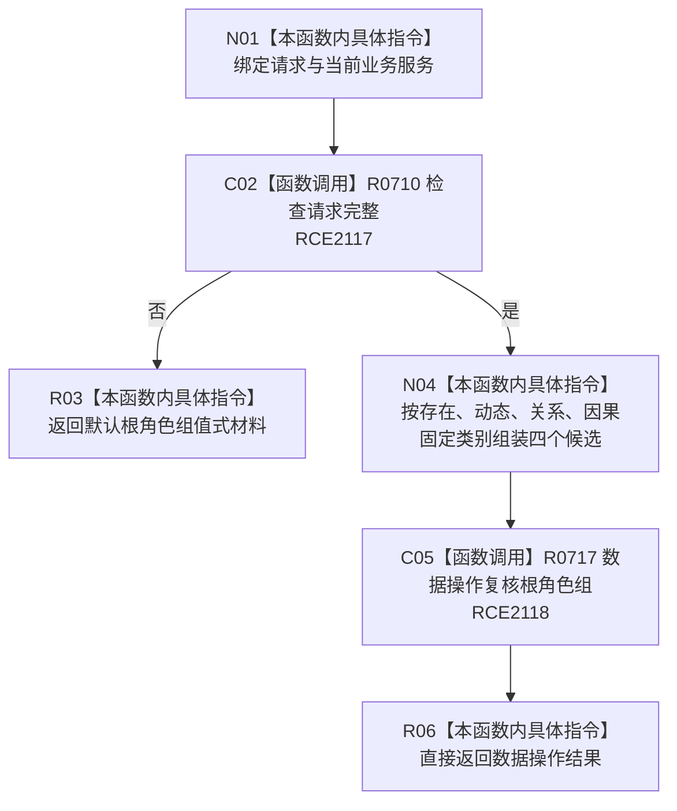

# CF-L7-0119 概念图结构业务服务复核根角色组现状流程图

图类型：现状流程图
代码版本：`03a8b7ac099ccea83e57f2696e2290b7bcdfacaf`
当前工作区复核基线：`b8a49bcb141d4fb8940225954dc328e54600030b`
源码 blob：`32e8a8739f139f19d1fdec4e79750b922cb8b15a`
覆盖文件：`海中鱼巣/领域/服务.概念图结构.ixx:83-91`
唯一根函数：R0711
完整签名：`海中鱼巣::概念根角色组值式材料 海中鱼巣::概念图结构业务服务::复核根角色组(const 海中鱼巣::复核概念根角色请求& 请求) const`
参数：`请求` 为只读借用；只读当前业务服务及其非拥有数据操作引用
返回结果：请求不完整时返回默认值式材料；完整时把四个请求身份绑定到固定根类别并直接返回数据操作复核结果
调用图：`流程图/主程序可达调用关系/00_main可达函数身份表.md`、`01_main可达项目调用边表.md`、`02_main可达外部边界表.md`
已登记调用方：F0455（RCE1872）、R0232（RCE2547）、R0236（RCE2557）
直接项目函数：R0710（RCE2117）、R0717（RCE2118）
外部边界：无
逐行映射表：`流程图/代码流程图/L7/CF-L7-0119_概念图结构业务服务复核根角色组_逐行代码映射表.md`
输入契约 / 调用语境表：本图内嵌审查；初始化路径提供四个根的稳定主键和节点句柄，服务先做字段完整性检查
非成功返回二分审查表：本图内嵌审查；入口材料不完整时返回默认材料，完整后数据操作状态原样向上传递
偏差清单：无独立文件；本批只记录当前代码事实
依据提交 / 结构化消息：冻结源码提交 `03a8b7ac099ccea83e57f2696e2290b7bcdfacaf` 与正式稳定边表
验证输出：Mermaid / 节点集合 / 逐行覆盖 PASS；目标 no-index 与 strict 检查 PASS；未构建、未运行
不得作为施工许可：是
不得宣称：默认材料等同成功、四个根已经存在，或数据操作复核一定通过

## 流程图

## 当前边界

- 服务层只固定四个请求字段对应的根类别；仓库读取、许可和角色一致性复核由 R0717 负责。
- 入口默认返回是非成功材料，不证明根角色组为空或已通过复核。
