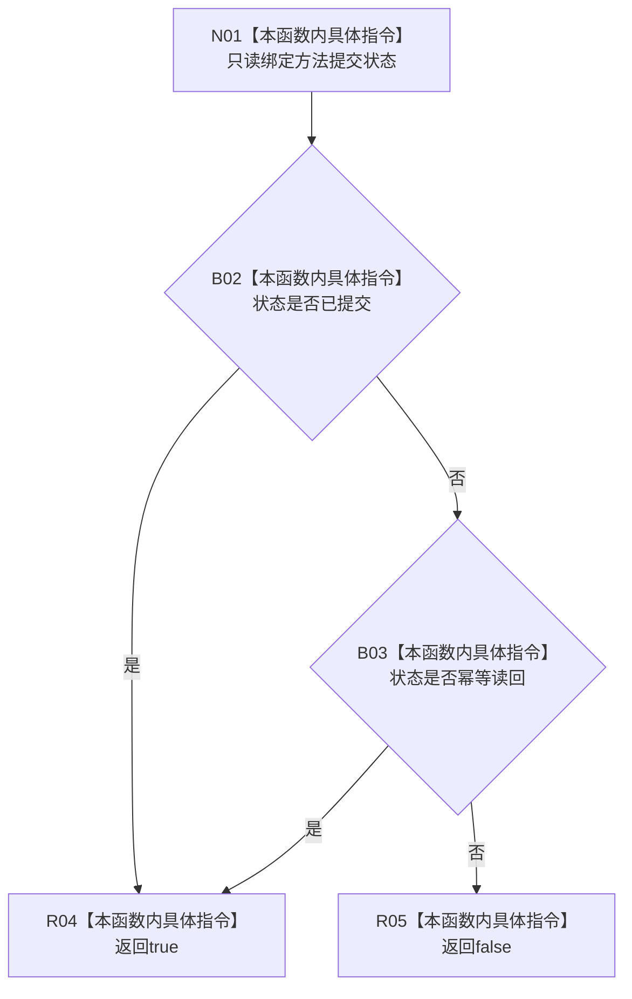

# CF-L7-0121 方法提交结果成功现状流程图

图类型：现状流程图
代码版本：`03a8b7ac099ccea83e57f2696e2290b7bcdfacaf`
当前工作区复核基线：`b8a49bcb141d4fb8940225954dc328e54600030b`
源码 blob：`16ac9534baeda26ac8a712066e713f3339f6e0c8`
覆盖文件：`海中鱼巣/领域/数据操作.需求任务方法.ixx:423-426`
唯一根函数：R0721
完整签名：`bool 海中鱼巣::方法提交结果::成功() const noexcept`
参数：无显式参数；只读业务状态
返回结果：状态为已提交或幂等读回时返回 `true`，其它返回 `false`
调用图：`流程图/主程序可达调用关系/00_main可达函数身份表.md`、`01_main可达项目调用边表.md`、`02_main可达外部边界表.md`
已登记调用方：F0455
直接项目函数：无
外部边界：无
逐行映射表：`流程图/代码流程图/L7/CF-L7-0121_方法提交结果成功_逐行代码映射表.md`
输入契约 / 调用语境表：本图内嵌审查；状态由方法提交业务结果形成
非成功返回二分审查表：本图内嵌审查；`false` 只表示非成功状态分类
偏差清单：无独立文件；本批只记录当前代码事实
依据提交 / 结构化消息：冻结源码提交 `03a8b7ac099ccea83e57f2696e2290b7bcdfacaf` 与正式身份表
验证输出：Mermaid / 节点集合 / 逐行覆盖 PASS；目标 no-index 与全仓 diff 检查 PASS；strict 108/108 PASS；未构建、未运行
不得作为施工许可：是
不得宣称：成功状态对应的结构已经独立读回或验收

## 流程图

## 当前边界

- 本函数不检查根、登记项或规格材料，只按状态枚举分类。
