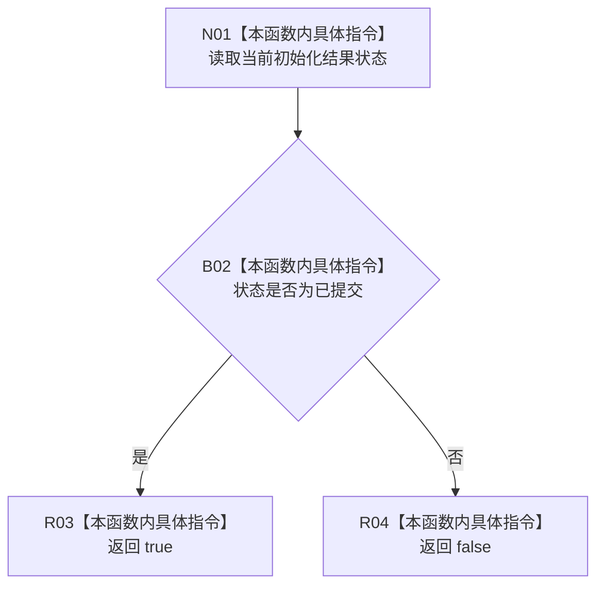

# CF-L7-0122 系统角色初始化结果改变了结构现状流程图

图类型：现状流程图
代码版本：`03a8b7ac099ccea83e57f2696e2290b7bcdfacaf`
当前工作区复核基线：`8632fb891fb3beea255aff1946c07b0fe975ef2b`
源码 blob：`c26b12e291f7192b887ef01efce9e6dc157e9cef`
覆盖文件：`海中鱼巣/领域/系统角色清单.数据.h:300`
唯一根函数：R0722
完整签名：`bool 海中鱼巣::系统角色初始化结果::改变了结构() const noexcept`
参数：无显式参数；只读当前初始化结果的 `状态`
返回结果：状态为已提交时返回 true，其它状态返回 false
调用图：`流程图/主程序可达调用关系/01_main可达项目调用边表.md`
逐行映射表：`流程图/代码流程图/L7/CF-L7-0122_系统角色初始化结果改变了结构_逐行代码映射表.md`
输入契约 / 调用语境表：本图“当前边界”节；未另建独立表
非成功返回二分审查表：false 只表示本结果状态不是已提交，不改写原业务状态
偏差清单：无 / 不适用；本图只登记当前实现事实
依据提交 / 结构化消息：源码冻结 `03a8b7ac099ccea83e57f2696e2290b7bcdfacaf`；无结构化执行消息
验证输出：配对逐行映射、节点集合、源码 blob 与本批机械审计
已登记调用方：F0455（RCE1875）
直接项目函数：无
外部边界：无
结构读写：无；只读结果状态
不得作为施工许可：是
不得宣称：true 证明所有系统角色材料完整，或结构改变已经过独立读回验证

## 流程图

## 当前边界

- F0455 在系统角色初始化结果成功后使用本谓词累计本次是否改变结构。
- 幂等读回返回 false；本函数不检查清单完整性。
